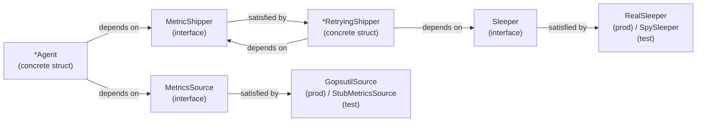
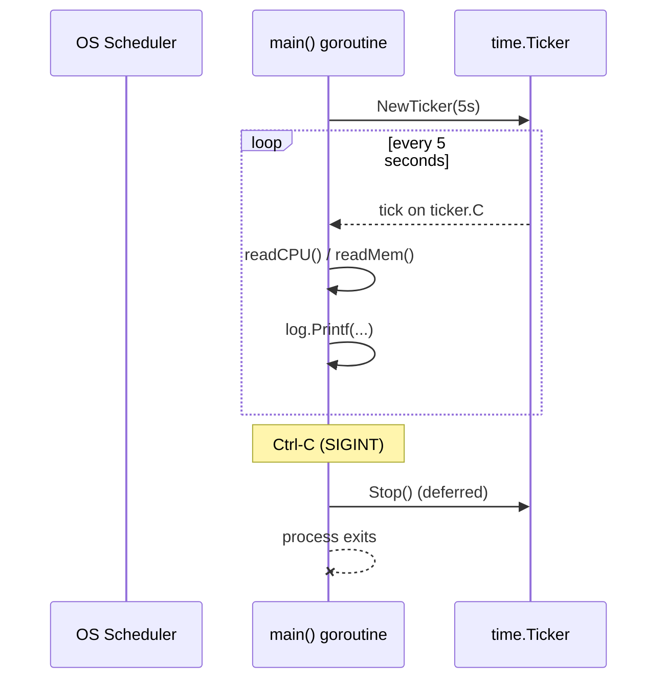
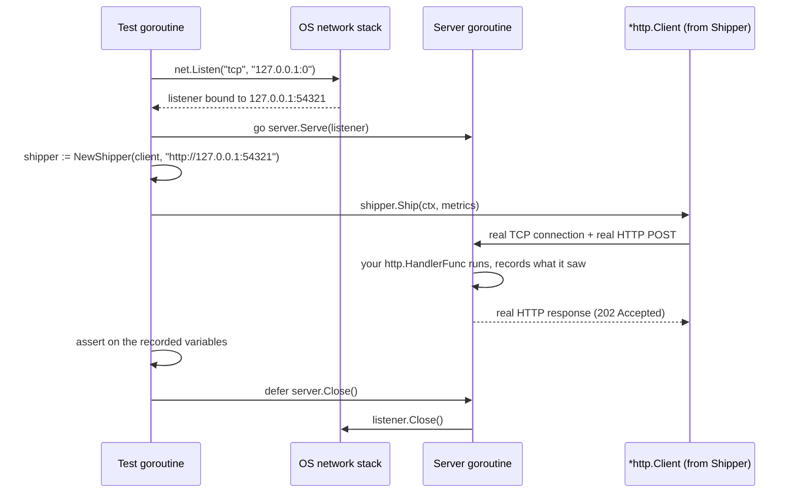
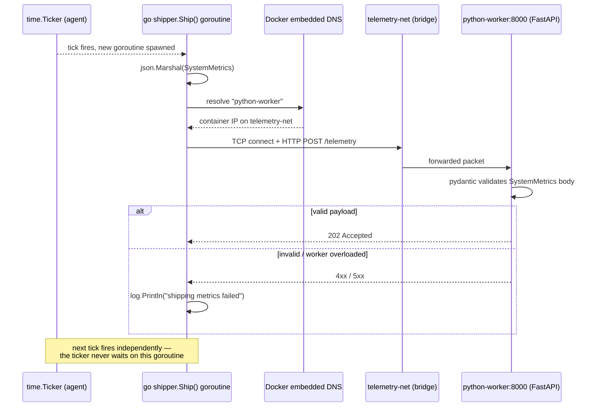
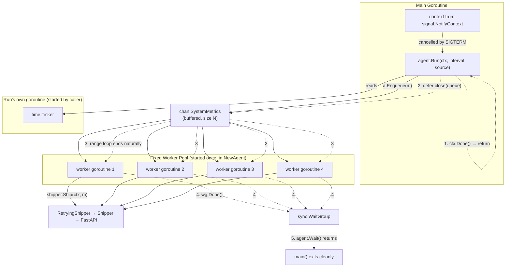
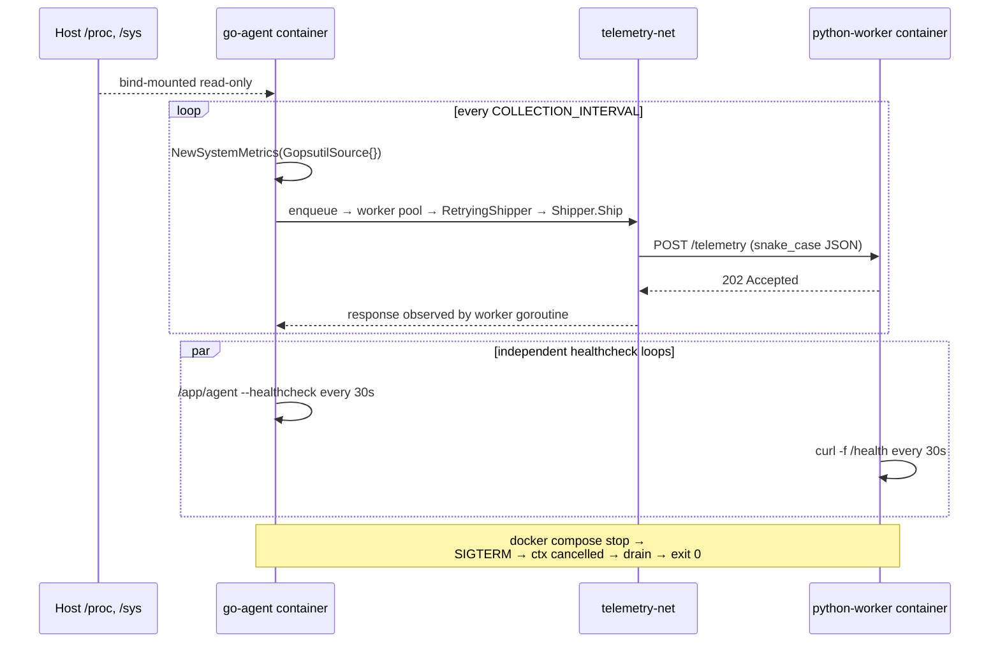

# Distributed Telemetry & Anomaly Detector
### The Complete Build & Hardening Guide — From Empty Module to Production-Ready Agent

*A test-driven, follow-along guide to building and hardening a Go telemetry producer — written in the [Learn Go with Tests](https://quii.gitbook.io) tradition: red, green, refactor, one behaviour at a time.*

```
$ go test -race ./...
ok      telemetry-agent    1.052s
```

**Project:** Distributed Telemetry & Anomaly Detector — summer microservice project
**Covers:** metric ingestion · interfaces · dependency injection · the ticker loop · concurrency & networking · `httptest` · mocking time · worker pools · graceful shutdown · Docker health checks · benchmarking & profiling · the race detector · production security
**Pedagogical style** after *Learn Go with Tests* (quii.gitbook.io) — applied here to an original project and codebase.

---

## Contents

**Part 0 — Orientation**
- How to Use This Guide
- Chapter 0 — Interfaces in Go: "Accept Interfaces, Return Structs"

**Part I — Building the Agent (Phases 1–4)**
- Phase 1 — Metric Ingestion
- Phase 2 — The Telemetry Loop
- Phase 3 — Concurrency & Networking, Done with Dependency Injection from the Start
- Phase 4 — Dockerization
- Where Part I Leaves You

**Part II — Hardening the Agent (Phases 5+)**
- Chapter 5 — Locking Down the JSON Contract
- Chapter 6 — Freeing the Collector from Real Hardware
- Chapter 7 — The Race Detector: Finding Bugs Your Tests Can't See
- Chapter 8 — Teaching the Shipper to Fail Gracefully
- Chapter 9 — From One Goroutine to a Worker Pool
- Chapter 10 — A Health Endpoint for Docker
- Chapter 11 — Configuration From the Environment
- Chapter 12 — Benchmarks and Profiling
- Chapter 13 — Wiring It Into docker-compose
- Chapter 14 — Graceful Shutdown, Contexts, Worker Pools & Production Observability

**Part III — Security**
- Chapter 15 — Securing the Agent: Practices and How to Test for Them

**Wrapping Up**
- Roadmap and Final Checklist

---

## How to Use This Guide

This guide merges the origin story of your Go agent (Phases 1–4: an empty module growing into a working producer) with its hardening
arc (Phase 5 onward: tested, resilient, observable, secure). They're written to read as one continuous build — same file names, same
function names, no seam where one guide used to end and the other began. The only structural change from the original two-part version
is this: **dependency injection for the HTTP shipper now happens in Phase 3, not later.** The old approach — ship first with a
package-level global, then replace it with a proper `Shipper` type in the hardening pass — was a reasonable teaching sequence, but it
meant writing code in Phase 3 you'd throw away in Chapter 8. This version does it right the first time and spends that saved time on
things that are actually new: diagrams, a dedicated interfaces chapter, the race detector, benchmarking, and a security pass.

### The TDD Loop

1. **Red** — write a test for behaviour that does not exist yet. Watch it fail.
2. **Green** — write the smallest amount of code that makes it pass. Resist the urge to build the whole feature yet.
3. **Refactor** — now that a test is protecting you, clean the code up. Re-run the test after every change.

Repeat. Each cycle should take a couple of minutes, not a couple of hours. Every code block is labelled with the file it belongs to, so
you always know where to paste it. Blocks that show a terminal are things you actually run.

### A Quick, Honest Note on TDD Here

Some of what you're building is inherently about real time and real hardware — a ticker that fires every five seconds, a function
that reads `/proc`. There's no clean way to unit test "does this actually wait five seconds" without dependency-injection machinery,
and that machinery is exactly what Chapter 0 and Phase 3 introduce **on purpose**, early, so that almost nothing later in this guide
has to touch real hardware or a real clock to be tested. Where something genuinely has no decidable behaviour yet — a Dockerfile, a
first draft of a loop with nothing to branch on — we write it directly, run it, and watch it work. Forcing a test onto code with
nothing to decide is busywork, not rigor, and knowing which is which is part of the skill.

### New in This Edition

Every chapter now ends with two things the original guides didn't have:

- **A Git commit checkpoint** — the exact commands to commit your work at a stable, green point, with a message that documents what
  changed and why. Small, working commits are what make `git bisect` useful later and what make code review sane.
- **Exercises that intentionally fail** — a task designed to break in a specific, instructive way. You're meant to hit the failure,
  understand *why* the guide's design prevents (or doesn't yet prevent) it, and only then look at the discussion underneath. Debugging
  a failure you caused yourself teaches the underlying mechanism far better than reading about it in the abstract.

### Prerequisites

- Go 1.22 or newer, Docker installed, and `git` on your `PATH`.
- Comfort running `go test ./...` and `go run .` locally, outside Docker — you'll only need Docker again at the very end of Part I and
  again in Chapter 13, to prove the containerized system still works.
- About four to six hours across a few sittings, not one sitting.

### Setup

```
$ mkdir telemetry-agent && cd telemetry-agent
$ git init
$ go mod init telemetry-agent
$ go get github.com/shirou/gopsutil/v3
$ git add -A && git commit -m "chore: initialize module and dependencies"
```

---

## Chapter 0 — Interfaces in Go: "Accept Interfaces, Return Structs"

Nearly every hardening technique in this guide — swapping real hardware for a stub, swapping a real clock for a fake one, swapping a
real HTTP call for a fake server — leans on the same Go idiom. It's worth naming it and understanding it once, up front, rather than
re-deriving it from scratch in Phase 3, Chapter 6, and Chapter 8.

### The Idiom

> **Accept interfaces, return structs.**

A function or constructor should ask for the *smallest possible interface* it needs from its callers, and hand back a *concrete type*
to whoever calls it. Concretely:

```go
// GOOD: accepts the narrow interface it actually needs.
func NewShipper(client HTTPDoer, endpoint string) *Shipper { ... }

// Also good: returns a concrete struct, not an interface.
func NewAgent(shipper MetricShipper, workers, queueSize int) *Agent { ... }
```

Two things follow from this, and both matter for testability:

1. **Small interfaces are cheap to fake.** An interface with one or two methods (`Ship(ctx, m) error`, `Sleep(d)`) is trivial to
   implement with a five-line stub in a test file. An interface with fifteen methods — or, worse, accepting a concrete `*http.Client`
   or a concrete `GopsutilSource` — either can't be faked at all, or requires an elaborate mock. **The size of the interface you
   depend on is the size of the test double you'll have to write.** This is why every interface in this guide (`MetricsSource`,
   `MetricShipper`, `Sleeper`, `HealthReporter`) has exactly one or two methods.

2. **Returning structs, not interfaces, keeps the caller's options open.** If `NewAgent` returned an `AgentInterface`, every future
   method you add to `*Agent` would require updating that interface everywhere it's declared, and callers would only ever see the
   subset of behaviour the interface declared on day one. Returning `*Agent` costs nothing — Go interfaces are satisfied implicitly,
   so any caller that only needs part of `*Agent`'s behaviour can declare their own narrow interface for it later, without `*Agent`
   ever knowing that interface exists. That's exactly what happens in Chapter 10: `*Agent` never declares that it implements
   `HealthReporter` — it just happens to have a `Healthy() bool` method, and that's enough.

### Where Interfaces Belong: At the Boundary, Not the Core

A common mistake when this idiom is new is to wrap *everything* in an interface "for testability," including types with no external
dependency at all — `SystemMetrics`, for instance, never needs an interface, because it's pure data with no side effect to fake.
Interfaces earn their place specifically at the seam between your logic and something slow, non-deterministic, or environment-specific:

| Boundary | What's hard to test directly | Interface introduced |
|---|---|---|
| Reading hardware stats | Real `/proc`, environment-dependent | `MetricsSource` (Chapter 6) |
| Sending an HTTP request | Real network, a real Python worker | `MetricShipper` / `HTTPDoer` (Phase 3) |
| Waiting between retries | Real wall-clock time | `Sleeper` (Chapter 8) |
| Reporting process health | Depends on the agent's internal state | `HealthReporter` (Chapter 10) |

Everything **inside** those boundaries — `SystemMetrics`, the JSON encoding, the retry-count arithmetic, the worker-pool bookkeeping —
is plain, deterministic Go and needs no interface to test. Reach for an interface when you notice a test would otherwise have to touch
a real clock, a real network, or real hardware — not by default.

### A Preview of the Payoff

Here's the shape you'll build toward by the end of Phase 3: a chain of small interfaces, each one satisfied by a concrete struct, each
one swappable in a test.



Notice `*RetryingShipper` both *satisfies* `MetricShipper` and *depends on* one — it wraps another shipper. That's the same pattern
`net/http`'s own middleware uses (`http.Handler` wrapping `http.Handler`), and it's why Chapter 8 can add retries to the shipper
without changing a single line of `*Agent`.

### Checkpoint

- No code yet — this chapter is a lens, not a phase. Keep the phrase *"accept interfaces, return structs"* in mind for the rest of
  the guide; every "why is there an interface here" question in later chapters resolves back to this one.

### Exercise (intentionally fails)

Before moving on, try this: write a function `func NewLogger(w io.Writer) *log.Logger` and a function
`func NewBadLogger(f *os.File) *log.Logger`. Write a table-driven test that calls both with a `*bytes.Buffer` standing in for the
destination. One of these compiles against a `bytes.Buffer`; one does not.

**Watch it fail**, read the compiler error carefully, and only then check: the failure is `*bytes.Buffer does not implement *os.File`
— because `NewBadLogger` accepted a concrete type instead of the `io.Writer` interface `*os.File` happens to satisfy. That's the whole
chapter, in one deliberately broken function.

---

# Part I — Building the Agent (Phases 1–4)

## Phase 1 — Metric Ingestion

Every telemetry sample the agent produces is one value: a timestamp, a CPU percentage, a memory percentage. Before writing anything
that reads real hardware, it's worth locking down that shape with a test — not because the struct is complicated, but because it's the
one piece of data that flows through everything else you'll build this summer, and a five-line test now is cheaper than a confusing
bug three phases from now.

### Red — Write the Test First

```go
// metrics_test.go
package main

import (
	"encoding/json"
	"testing"
	"time"
)

func TestSystemMetricsRoundTrip(t *testing.T) {
	want := SystemMetrics{
		Timestamp: time.Date(2026, 6, 20, 9, 0, 0, 0, time.UTC),
		CPUUsage:  55.4,
		MemUsage:  71.2,
	}

	encoded, err := json.Marshal(want)
	if err != nil {
		t.Fatalf("did not expect an error, got %v", err)
	}

	var got SystemMetrics
	if err := json.Unmarshal(encoded, &got); err != nil {
		t.Fatalf("did not expect an error, got %v", err)
	}

	if got != want {
		t.Errorf("got %+v, want %+v", got, want)
	}
}
```

**Why `time.Date(...)` and not `time.Now()`?** `time.Now()` carries an internal monotonic reading alongside the wall-clock time, used
for accurate duration measurements. That monotonic component doesn't survive a round trip through JSON, so comparing a freshly-created
`time.Now()` value against one that's been marshalled and unmarshalled can fail even though the time itself is identical. A fixed
`time.Date(...)` sidesteps the issue — a good default for any test comparing `time.Time` values directly.

```
$ go test ./...
./metrics_test.go:12:9: undefined: SystemMetrics
FAIL    telemetry-agent [build failed]
```

### Green — Make It Pass

```go
// metrics.go
package main

import "time"

// SystemMetrics is one telemetry sample: a snapshot of CPU and memory
// usage at a point in time.
type SystemMetrics struct {
	Timestamp time.Time
	CPUUsage  float64
	MemUsage  float64
}
```

```
$ go test ./...
ok      telemetry-agent    0.003s
```

### Refactor — Nothing to Do Yet, and That's Fine

There's no duplication, no unclear naming, nothing to extract. Not every green bar needs a refactor step — resist the habit of
changing things just to feel like you did something. The struct is exactly as complicated as the data it represents.

> **This test isn't checking the same thing Chapter 5 checks — on purpose.** `TestSystemMetricsRoundTrip` only proves the type is
> internally consistent: encode it, decode it, get the same values back. It says nothing about whether the keys match what a Python
> service expects — there's no Python service yet to compare against. That's a genuinely different kind of test (a *contract* test,
> not a *round-trip* test), and it's exactly what Chapter 5 adds once both sides of the system exist.

### Checkpoint

`SystemMetrics` exists, is JSON-serialisable, and has a test protecting its shape.

```
$ go test ./...
ok      telemetry-agent    0.003s
$ git add -A && git commit -m "feat(metrics): add SystemMetrics with round-trip test

Locks down the shape of the one struct that flows through the whole
agent before anything else is built on top of it."
```

### Exercise (intentionally fails)

Add a fourth field to `SystemMetrics` — `DiskUsage float64` — but only in the struct definition, not in the test's `want` value.
Run `go test ./...`.

**It passes.** That's the trap: `TestSystemMetricsRoundTrip` compares `got != want` using zero-valued struct equality, so an
*unpopulated* new field round-trips fine — both sides are `0`. This is exactly the blind spot Chapter 5's map-based contract test is
designed to catch instead, once field *names* (not just values) matter. Keep the field for now; you'll revisit this exact gap there.

---

## Phase 2 — The Telemetry Loop

Now the part that actually watches the machine: a loop that wakes up every few seconds and takes a reading. `time.Ticker` is the
standard-library tool for "do this repeatedly, on a schedule," and it's worth understanding why it beats the first thing most people
reach for.

### `time.Ticker` vs. `time.Sleep` in a Loop

```go
for {
	collect()
	time.Sleep(5 * time.Second)
}
```

looks equivalent to a ticker, but it isn't: `collect()` itself takes some non-zero time, so the real interval is
`5s + collect()'s duration`, not `5s` — and that drift compounds. `time.NewTicker` fires on a fixed schedule regardless of how long
your work takes (as long as it's shorter than the interval), and — just as important — it's a value you can `Stop()`, which matters
the moment you care about shutting down cleanly. `time.Sleep` gives you nothing to hold onto once you're inside it.

Reading real hardware means bringing in `gopsutil`. Wrap the two readings in small functions now — not because they're testable yet
(they call real hardware, so they aren't, and that's fine for this phase), but because "one function, one job" makes the loop itself
easy to read.

### Write It

```go
// hardware.go
package main

import (
	"github.com/shirou/gopsutil/v3/cpu"
	"github.com/shirou/gopsutil/v3/mem"
)

func readCPU() float64 {
	// interval 0 returns the percentage change since the last call,
	// instantly, instead of blocking the tick for a full second.
	percentages, err := cpu.Percent(0, false)
	if err != nil || len(percentages) == 0 {
		return 0
	}
	return percentages[0]
}

func readMem() float64 {
	v, err := mem.VirtualMemory()
	if err != nil {
		return 0
	}
	return v.UsedPercent
}
```

```go
// main.go
package main

import (
	"log"
	"time"
)

func main() {
	ticker := time.NewTicker(5 * time.Second)
	defer ticker.Stop()

	for range ticker.C {
		m := SystemMetrics{
			Timestamp: time.Now(),
			CPUUsage:  readCPU(),
			MemUsage:  readMem(),
		}
		log.Printf("collected: %+v", m)
	}
}
```

### Architecture: The Goroutine Lifecycle So Far

Right now there's exactly one goroutine — `main` itself — blocking on the ticker's channel. It's worth drawing this now, because every
later phase adds one more goroutine to this same picture, and the diagram is the clearest way to track what's running when.



Nothing here runs concurrently with anything else yet — `main` reads, then logs, then waits for the next tick. That changes the moment
shipping enters the picture in Phase 3.

### Run It

```
$ go run .
2026/06/20 09:00:05 collected: {Timestamp:2026-06-20 09:00:05 CPUUsage:4.1 MemUsage:38.7}
2026/06/20 09:00:10 collected: {Timestamp:2026-06-20 09:00:10 CPUUsage:6.8 MemUsage:38.7}
2026/06/20 09:00:15 collected: {Timestamp:2026-06-20 09:00:15 CPUUsage:3.2 MemUsage:38.9}
^C
```

Five-second intervals, real numbers, no test in sight — and that's the right call here. There's no branch, no calculation, no edge
case in this loop for a test to protect; it's wiring. The moment that changes — the moment `readCPU`/`readMem` become swappable and
the loop's behaviour becomes something a test can pin down — is Chapter 6.

### Checkpoint

The agent prints a real telemetry sample every five seconds and stops cleanly on Ctrl-C.

```
$ git add -A && git commit -m "feat(loop): collect real CPU/mem metrics on a 5s ticker

Uses time.Ticker instead of time.Sleep to avoid interval drift, and
defers Stop() so the ticker's resources are released on exit."
```

### Exercise (intentionally fails)

Replace `time.NewTicker(5 * time.Second)` with `time.Sleep(5 * time.Second)` inside the loop (drop the ticker entirely), and add a
`time.Sleep(2 * time.Second)` at the top of the loop body to simulate slow hardware reads. Run the agent for one minute and log the
wall-clock time of each line.

**Watch it drift**: instead of firing at `:00, :05, :10, :15`, you'll see roughly `:00, :07, :14, :21` — the artificial 2-second read
is added onto every interval instead of being absorbed by it. This is the exact failure mode the "why Ticker, not Sleep" callout
above warned about — now you've reproduced it on purpose. Revert back to `time.NewTicker` before continuing.

---

## Phase 3 — Concurrency & Networking, Done with Dependency Injection from the Start

Shipping a sample to the Python worker is an HTTP POST — and unlike the ticker loop, this has real decidable behaviour: build the
right body, hit the right URL, handle failure without crashing. That's testable today. The earlier version of this guide reached for
a package-level variable here as a quick way to make the destination swappable in a test, and only replaced it with real dependency
injection later, once the "hardening" pass began. This edition skips that detour: you already met the idiom in Chapter 0, so we use it
immediately. A `*Shipper` that's constructed with its dependencies, from its very first line of code, is no more work to write than a
package-level variable — and it means nothing you write in this phase gets thrown away later.

> **What you're *not* doing, and why:** a tempting shortcut is a package-level `var telemetryEndpoint = "..."` that a test overwrites
> for the duration of one test function. It works, but it's shared mutable global state — tests that touch it can't run with
> `t.Parallel`, and nothing stops another part of the program from changing it out from under a running test. Constructor injection
> has none of those problems and costs one extra parameter.

### Red — Write the Test First

```go
// shipper_test.go
package main

import (
	"context"
	"encoding/json"
	"net/http"
	"net/http/httptest"
	"testing"
	"time"
)

func TestShipper_Ship(t *testing.T) {
	var (
		gotMethod       string
		gotPath         string
		gotContentType  string
		received        SystemMetrics
		decodeErr       error
	)

	server := httptest.NewServer(http.HandlerFunc(
		func(w http.ResponseWriter, r *http.Request) {
			gotMethod = r.Method
			gotPath = r.URL.Path
			gotContentType = r.Header.Get("Content-Type")
			decodeErr = json.NewDecoder(r.Body).Decode(&received)
			w.WriteHeader(http.StatusAccepted)
		}))
	defer server.Close()

	shipper := NewShipper(server.Client(), server.URL)

	metrics := SystemMetrics{
		Timestamp: time.Now(),
		CPUUsage:  91.2,
		MemUsage:  55.0,
	}

	err := shipper.Ship(context.Background(), metrics)
	if err != nil {
		t.Fatalf("did not expect an error, got %v", err)
	}
	if decodeErr != nil {
		t.Fatalf("server could not decode the request body: %v", decodeErr)
	}
	if gotMethod != http.MethodPost {
		t.Errorf("got method %s, want %s", gotMethod, http.MethodPost)
	}
	if gotPath != "/telemetry" {
		t.Errorf("got path %s, want /telemetry", gotPath)
	}
	if gotContentType != "application/json" {
		t.Errorf("got Content-Type %s, want application/json", gotContentType)
	}
	if received.CPUUsage != metrics.CPUUsage {
		t.Errorf("server received CPU usage %v, want %v", received.CPUUsage, metrics.CPUUsage)
	}
}
```

**Why the assertions live in variables, not `t.Fatalf` inside the handler:** `httptest.NewServer` runs your handler on its own
goroutine, separate from the one running the test. Calling `t.Fatal` from any goroutine but the test's own is unsafe. Recording what
happened into a variable and asserting on it afterwards, back in the test goroutine, sidesteps the problem — a pattern worth reusing
anywhere a handler or callback runs concurrently with the test.

```
$ go test ./...
./shipper_test.go:22:15: undefined: NewShipper
FAIL    telemetry-agent [build failed]
```

### Green — Make It Compile, Then Make It Pass

Notice the constructor's first parameter: not a concrete `*http.Client`, but `*http.Client` itself is fine to accept directly here
*because `server.Client()` already returns one* — there's no interface to narrow further without inventing one, and `*http.Client`
is itself already a flexible, well-tested seam (its `Transport` field is swappable). Where Chapter 0's idiom really bites is one level
up, in `MetricShipper` — the interface `*Shipper` will satisfy for everything that calls it.

```go
// shipper.go
package main

import (
	"bytes"
	"context"
	"encoding/json"
	"fmt"
	"net/http"
)

type Shipper struct {
	client   *http.Client
	endpoint string
}

func NewShipper(client *http.Client, endpoint string) *Shipper {
	return &Shipper{client: client, endpoint: endpoint}
}

func (s *Shipper) Ship(ctx context.Context, m SystemMetrics) error {
	body, err := json.Marshal(m)
	if err != nil {
		return fmt.Errorf("encoding metrics: %w", err)
	}

	req, err := http.NewRequestWithContext(
		ctx, http.MethodPost, s.endpoint+"/telemetry", bytes.NewReader(body),
	)
	if err != nil {
		return fmt.Errorf("building request: %w", err)
	}
	req.Header.Set("Content-Type", "application/json")

	resp, err := s.client.Do(req)
	if err != nil {
		return fmt.Errorf("sending metrics: %w", err)
	}
	defer resp.Body.Close()

	if resp.StatusCode >= 300 {
		return fmt.Errorf("worker responded with status %d", resp.StatusCode)
	}
	return nil
}
```

```
$ go test ./...
ok      telemetry-agent    0.006s
```

We should also cover the unhappy path — the Python worker is down, or returns a `500`:

```go
// shipper_test.go
func TestShipper_ShipServerError(t *testing.T) {
	server := httptest.NewServer(http.HandlerFunc(
		func(w http.ResponseWriter, r *http.Request) {
			w.WriteHeader(http.StatusInternalServerError)
		}))
	defer server.Close()

	shipper := NewShipper(server.Client(), server.URL)

	err := shipper.Ship(context.Background(), SystemMetrics{})
	if err == nil {
		t.Fatal("expected an error for a 500 response, got nil")
	}
}
```

That passes immediately — the `resp.StatusCode >= 300` check was already written to handle it. Not every test in a TDD workflow finds
a bug; some just document a behaviour you already have, which is exactly as valuable.

### Why `httptest.Server` Works Internally

It's tempting to treat `httptest.NewServer` as magic — "it makes a fake URL, sure, fine" — but understanding what it actually does
pays off the first time a test involving it misbehaves (a leaked goroutine, a port-exhaustion flake in CI, a hang because `Close()`
was never called).

`httptest.NewServer` does **not** simulate HTTP in memory. It does three very real things:

1. It opens a real TCP listener on `127.0.0.1`, on a kernel-assigned free port — `net.Listen("tcp", "127.0.0.1:0")`. The `:0` is the
   part that asks the OS for whatever port happens to be free, which is why two calls to `httptest.NewServer` never collide even when
   run in parallel.
2. It starts a real `*http.Server` (the same type your production code would use) serving your `http.Handler` on that listener, in a
   background goroutine.
3. It reports the resulting address back as `server.URL` — a real `http://127.0.0.1:PORT` string — and `server.Client()` hands back a
   real `*http.Client`, pre-configured to trust that server's certificate if you used `httptest.NewTLSServer` instead.



This is *why* the test is trustworthy: your `Shipper` is exercising exactly the same code path — `net/http`'s real request
marshalling, real header handling, a real TCP round trip over loopback — that it will use against the real Python worker. Nothing
about `http.Post` or `http.Client.Do` is mocked; only the *destination* is swapped, for a real server that happens to live in the
same process. That's also precisely why `defer server.Close()` isn't optional housekeeping: forgetting it leaves the listener
goroutine (and the bound port) alive for the rest of the test binary's run, and a large suite that leaks a few hundred of these will
eventually fail with `too many open files` rather than a readable assertion error.

### Refactor — Extract the Request Builder, and Set a Client Timeout

`Ship` is doing two things: building a request, and sending it. Splitting them makes each easier to read.

```go
// shipper.go
func (s *Shipper) Ship(ctx context.Context, m SystemMetrics) error {
	req, err := newTelemetryRequest(ctx, s.endpoint, m)
	if err != nil {
		return err
	}

	resp, err := s.client.Do(req)
	if err != nil {
		return fmt.Errorf("sending metrics: %w", err)
	}
	defer resp.Body.Close()

	if resp.StatusCode >= 300 {
		return fmt.Errorf("worker responded with status %d", resp.StatusCode)
	}
	return nil
}

func newTelemetryRequest(
	ctx context.Context, endpoint string, m SystemMetrics,
) (*http.Request, error) {
	body, err := json.Marshal(m)
	if err != nil {
		return nil, fmt.Errorf("encoding metrics: %w", err)
	}

	req, err := http.NewRequestWithContext(
		ctx, http.MethodPost, endpoint+"/telemetry", bytes.NewReader(body),
	)
	if err != nil {
		return nil, fmt.Errorf("building request: %w", err)
	}
	req.Header.Set("Content-Type", "application/json")
	return req, nil
}
```

Run the tests again — still green, because the refactor didn't change behaviour, only structure. Now give the client passed into
`NewShipper` a timeout, so a Python worker that never responds can't hang the agent forever:

```go
// main.go
httpClient := &http.Client{Timeout: 5 * time.Second}
shipper := NewShipper(httpClient, "http://python-worker:8000")
```

### Wire It Into the Loop, Off the Critical Path

`shipper.Ship` blocks on a network call. Called directly from the ticker loop, a slow or unreachable worker would delay every future
tick — the collection loop would inherit the network's latency. A goroutine decouples them: the tick fires on schedule regardless of
how long shipping takes.

```go
// main.go
for range ticker.C {
	m := SystemMetrics{
		Timestamp: time.Now(),
		CPUUsage:  readCPU(),
		MemUsage:  readMem(),
	}
	go func() {
		if err := shipper.Ship(context.Background(), m); err != nil {
			log.Println("shipping metrics failed:", err)
		}
	}()
}
```

### Sequence Diagram: Agent → Docker Network → FastAPI Worker

This is the shape of the real, end-to-end journey one sample takes once both sides of the system exist — the picture the `Shipper`
you just built is standing in for in every test. Keep it in mind through Phase 4 and into Chapter 13, where the two containers
actually meet.



The two things worth internalising from this diagram: the ticker and the shipping goroutine are on **separate timelines** (that's
the whole point of Phase 3), and `python-worker` is a *hostname resolved by Docker's embedded DNS*, not a static IP — which is exactly
why the earlier "quick" version of this guide used a configurable endpoint rather than a hardcoded address from day one, and why
`localhost` never appears in the container's own config.

### Checkpoint

The agent collects a sample every five seconds and ships it to the Python worker in the background — through real dependency
injection, tested against a real (loopback) HTTP server, without the network ever slowing down collection.

```
$ go test -race ./...
ok      telemetry-agent    0.021s
$ git add -A && git commit -m "feat(shipper): add Shipper with constructor-injected client+endpoint

Ships samples via a background goroutine so a slow worker never
delays the next collection tick. Tested end-to-end against a real
httptest.Server rather than a package-level variable."
```

### Exercise (intentionally fails)

In `TestShipper_Ship`, delete the line `defer server.Close()`. Add a second, unrelated test function below it —
`TestShipper_ShipServerError` (already in your file) — and run `go test -v -count=1 ./...` several times in a row, then run
`go test -run . -count=1000 ./... 2>&1 | tail -20` if you have a moment (or just imagine scaling this file to 500 tests).

**What you're meant to notice**, without necessarily reproducing `too many open files` on your machine (it depends on your OS's file
descriptor limit): every `httptest.NewServer` you don't close leaves a listening goroutine and an open socket alive for the rest of
the test binary's process. It usually "works" in a small file — which is exactly what makes the missing `defer` easy to miss in
review. Put the `defer server.Close()` back before continuing.

---

## Phase 4 — Dockerization

The last piece for this phase isn't Go at all — it's getting the binary into a container small enough to bind-mount `/proc` and
`/sys` into without dragging along a full OS. A multi-stage Dockerfile builds with the full Go toolchain, then ships only the compiled
binary in a minimal final image. There's no test for a Dockerfile; this section is build-it-and-run-it, same as Phase 2.

### Write It

```dockerfile
# Dockerfile
# ---- build stage ----
FROM golang:1.22-alpine AS build
WORKDIR /src
COPY go.mod go.sum ./
RUN go mod download
COPY . .
RUN CGO_ENABLED=0 GOOS=linux go build -o /app/agent .

# ---- run stage ----
FROM scratch
COPY --from=build /app/agent /app/agent
ENTRYPOINT ["/app/agent"]
```

**`CGO_ENABLED=0`, and why `scratch` even boots:** `gopsutil` is pure Go on Linux — no C dependencies — so disabling cgo is safe and
produces a fully static binary. That's what makes `FROM scratch` possible at all: there's no shell, no libc, no package manager in
the final image, only the binary. It's also why a naive `HEALTHCHECK CMD curl ...` won't work in this image — there's no `curl` to
run. That gap gets addressed properly in Chapter 10.

### Build and Run It

```
$ docker build -t telemetry-agent .
[+] Building 14.2s (11/11) FINISHED

$ docker run --rm \
    -v /proc:/host/proc:ro \
    -v /sys:/host/sys:ro \
    telemetry-agent
2026/06/20 09:12:00 collected: {Timestamp:2026-06-20 09:12:00 CPUUsage:5.4 MemUsage:41.2}
2026/06/20 09:12:05 collected: {Timestamp:2026-06-20 09:12:05 CPUUsage:7.1 MemUsage:41.2}
```

### Checkpoint

The whole agent — struct, ticker loop, shipping goroutine — runs inside a minimal container, reading the real host's `/proc` and
`/sys` through a bind mount.

```
$ git add -A && git commit -m "chore(docker): add multi-stage Dockerfile targeting scratch

Static binary via CGO_ENABLED=0 keeps the final image dependency-free;
no shell or curl available yet — health checks come in Chapter 10."
```

### Exercise (intentionally fails)

Remove the `-v /proc:/host/proc:ro` mount and run the container again. The agent doesn't crash — it happily reports a CPU/mem
reading. **That's the trap.** Without the bind mount, `gopsutil` is reading the *container's own* (nearly empty, cgroup-limited)
`/proc`, not the host's — the numbers it reports are for a process with almost no measurable load, not your machine. A silently
plausible-looking wrong number is worse than a crash, because nothing in this guide's current test suite would catch it: there's no
integration test asserting the mount is present. Put the mount back, and hold onto this gap — it's exactly the kind of thing a health
check (Chapter 10) and good observability (Chapter 14) are meant to surface, not prevent.

---

## Where Part I Leaves You

Four phases in, you have a Go agent that genuinely works: it reads real CPU and memory usage on a fixed schedule, ships each sample to
a Python worker through a properly dependency-injected `Shipper` — tested against a real server, never a fake in-memory stub of HTTP
itself — and runs inside a container small enough to have nothing in it but the binary. You also have, written down rather than
hidden, a short list of what it doesn't do yet:

- `SystemMetrics` has no JSON tags, so it ships `CPUUsage`, not `cpu_usage` — the Python side's `pydantic` model won't match it yet.
- `readCPU`/`readMem` call `gopsutil` directly, so nothing in `main` can be unit tested without real hardware.
- `go shipper.Ship(...)` is fire-and-forget: a failed request is logged and forgotten, there's no retry, no bound on how many of these
  goroutines can be in flight at once, and nothing waits for them before the process exits.
- There's no way to stop the loop cleanly. `docker stop` will `SIGKILL` it after its grace period, mid-flight goroutines and all.
- There's no way for Docker — or you — to ask "is this thing actually healthy?" beyond "is the process still running."

That list isn't a defect in this phase; it's the table of contents for Part II.

---

# Part II — Hardening the Agent (Phases 5+)

This is the point where working code becomes tested, resilient, observable code. It follows the *Learn Go with Tests* method
throughout: red, green, refactor. Because Phase 3 already introduced `Shipper` with real dependency injection, this part doesn't need
to spend a chapter replacing a global variable — that work is done. What's left is: the JSON contract, freeing the collector from real
hardware, catching concurrency bugs with the race detector, teaching the shipper to retry, bounding concurrency with a worker pool,
adding a health endpoint, externalising configuration, benchmarking the hot paths, wiring the whole thing into `docker-compose`, and —
in Part III — a dedicated pass on security.

> **Why bother testing an agent that mostly reads `/proc`?** You can't unit test a CPU spike. What you *can* test — and what actually
> breaks in practice — is everything around the hardware read: does the JSON match what Python expects, does a network blip get
> retried, does the process shut down cleanly when Docker sends `SIGTERM`, does a slow worker back up forever. That's what the rest of
> this guide covers. The sliver that touches real hardware stays a thin, deliberately untested adapter — you already saw exactly where
> that line gets drawn in Chapter 6.

---

## Chapter 5 — Locking Down the JSON Contract

The first bug in a two-language system is almost never logic — it's the seam between the languages. Go's default JSON encoding uses
the exported field name verbatim. Python's `pydantic` convention is `snake_case`. Left alone, these two facts guarantee a silent
integration bug: the Python worker will receive a payload where every field is missing, because `CPUUsage` isn't `cpu_usage`. Let's
write a test that would have caught it.

### Red — Write the Test First

```go
// metrics_test.go
func TestSystemMetricsJSON(t *testing.T) {
	m := SystemMetrics{
		Timestamp: time.Date(2026, 7, 2, 12, 0, 0, 0, time.UTC),
		CPUUsage:  42.5,
		MemUsage:  63.1,
	}

	got, err := json.Marshal(m)
	if err != nil {
		t.Fatalf("did not expect an error marshalling metrics, got %v", err)
	}

	want := `{"timestamp":"2026-07-02T12:00:00Z","cpu_usage":42.5,"mem_usage":63.1}`
	if string(got) != want {
		t.Errorf("got %s\nwant %s", got, want)
	}
}
```

```
$ go test ./...
--- FAIL: TestSystemMetricsJSON (0.00s)
    metrics_test.go:20: got  {"Timestamp":"2026-07-02T12:00:00Z","CPUUsage":42.5,"MemUsage":63.1}
        want {"timestamp":"2026-07-02T12:00:00Z","cpu_usage":42.5,"mem_usage":63.1}
FAIL
```

Exactly the bug predicted — capitalised field names. This is the whole point of writing the test before touching the struct: it turns
a bug you'd otherwise discover by staring at empty fields in a FastAPI log into a two-second, unambiguous failure.

### Green — Make It Pass

```go
// metrics.go
package main

import "time"

type SystemMetrics struct {
	Timestamp time.Time `json:"timestamp"`
	CPUUsage  float64   `json:"cpu_usage"`
	MemUsage  float64   `json:"mem_usage"`
}
```

```
$ go test ./...
ok      telemetry-agent    0.004s
```

### Refactor — A String-Equality Test Is More Brittle Than It Looks

The test above passes today, but it's coupled to Go's exact key order and spacing, neither of which is part of the actual contract —
Python doesn't care what order the keys arrive in. A round-trip test is a better fit: encode, decode into a generic map, and check the
values you actually care about. This is also, finally, the test that catches the `DiskUsage` gap from Phase 1's exercise: an unpopulated
new field now shows up (or fails to) as a **named key**, not a zero-valued struct field, so a Python-side key mismatch can't hide
behind matching zero values anymore.

```go
// metrics_test.go
func TestSystemMetricsJSON(t *testing.T) {
	m := SystemMetrics{
		Timestamp: time.Date(2026, 7, 2, 12, 0, 0, 0, time.UTC),
		CPUUsage:  42.5,
		MemUsage:  63.1,
	}

	encoded, err := json.Marshal(m)
	if err != nil {
		t.Fatalf("did not expect an error marshalling metrics, got %v", err)
	}

	var decoded map[string]any
	if err := json.Unmarshal(encoded, &decoded); err != nil {
		t.Fatalf("did not expect an error unmarshalling metrics, got %v", err)
	}

	wantKeys := map[string]any{
		"timestamp": "2026-07-02T12:00:00Z",
		"cpu_usage": 42.5,
		"mem_usage": 63.1,
	}
	for key, want := range wantKeys {
		got, ok := decoded[key]
		if !ok {
			t.Errorf("expected key %q in JSON output, it was missing", key)
			continue
		}
		if got != want {
			t.Errorf("key %q: got %v, want %v", key, got, want)
		}
	}
}
```

**The Python side of this contract** — keep the two models next to each other while you build; a mismatch here is the single most
common bug in a two-language project like this one:

```python
class SystemMetrics(BaseModel):
    timestamp: datetime
    cpu_usage: float
    mem_usage: float
```

### Checkpoint

`go test ./...` is green, and `SystemMetrics` now encodes exactly what the Python worker expects.

```
$ git add -A && git commit -m "fix(metrics): add snake_case json tags to match pydantic contract

Round-trip-via-map test catches key mismatches by name, not just by
value, closing the blind spot from the Phase 1 zero-value exercise."
```

### Exercise (intentionally fails)

Rename the `mem_usage` tag on the Python side to `memory_usage` (just imagine the edit, or make it in a scratch `.py` file) without
touching the Go struct, then re-run the Go test suite.

**It stays green.** That's deliberate, and worth sitting with: `TestSystemMetricsJSON` is a contract test for *one side* of the
contract. Go has no way to know the Python model changed underneath it — there's no shared schema file, no CI job comparing the two.
This is a real limitation of hand-written parallel structs, and the honest fix is out of scope for a Go-only guide: either generate
both sides from one schema (e.g., a shared JSON Schema or protobuf definition), or add a cross-language integration test that
actually posts to a running FastAPI instance and checks the response — which is exactly what Chapter 13's `docker-compose` pass makes
possible for the first time.

---

## Chapter 6 — Freeing the Collector from Real Hardware

Right now, collecting a metric means calling `gopsutil` directly, which means testing it means reading real `/proc` — slow,
environment-dependent, and impossible to make report "CPU at 97%" on demand to check alerting logic later. The fix is the idiom from
Chapter 0: put a narrow interface between your logic and the thing that's hard to test, so a test can hand in a fake.

### Red — Write the Test First

```go
// collector_test.go
package main

import "testing"

type StubMetricsSource struct {
	cpu float64
	mem float64
	err error
}

func (s StubMetricsSource) CPUPercent() (float64, error)     { return s.cpu, s.err }
func (s StubMetricsSource) MemUsedPercent() (float64, error) { return s.mem, s.err }

func TestNewSystemMetrics(t *testing.T) {
	t.Run("builds a sample from the source", func(t *testing.T) {
		source := StubMetricsSource{cpu: 87.3, mem: 45.0}

		got, err := NewSystemMetrics(source)
		if err != nil {
			t.Fatalf("did not expect an error, got %v", err)
		}
		if got.CPUUsage != 87.3 {
			t.Errorf("got CPU usage %v, want %v", got.CPUUsage, 87.3)
		}
		if got.MemUsage != 45.0 {
			t.Errorf("got mem usage %v, want %v", got.MemUsage, 45.0)
		}
		if got.Timestamp.IsZero() {
			t.Error("expected Timestamp to be set, got the zero value")
		}
	})

	t.Run("surfaces an error from the source", func(t *testing.T) {
		source := StubMetricsSource{err: errBoom}

		_, err := NewSystemMetrics(source)
		if err == nil {
			t.Fatal("expected an error, got nil")
		}
	})
}
```

```go
// errors_test.go
package main

import "errors"

var errBoom = errors.New("boom")
```

```
$ go test ./...
./collector_test.go:22:14: undefined: NewSystemMetrics
FAIL    telemetry-agent [build failed]
```

### Green — Make It Pass

```go
// collector.go
package main

import (
	"fmt"
	"time"
)

// MetricsSource abstracts the underlying system-stats provider so that
// tests can supply canned values instead of reading real hardware.
type MetricsSource interface {
	CPUPercent() (float64, error)
	MemUsedPercent() (float64, error)
}

// NewSystemMetrics builds one telemetry sample by reading source.
func NewSystemMetrics(source MetricsSource) (SystemMetrics, error) {
	cpu, err := source.CPUPercent()
	if err != nil {
		return SystemMetrics{}, fmt.Errorf("reading cpu percent: %w", err)
	}
	mem, err := source.MemUsedPercent()
	if err != nil {
		return SystemMetrics{}, fmt.Errorf("reading mem percent: %w", err)
	}
	return SystemMetrics{
		Timestamp: time.Now(),
		CPUUsage:  cpu,
		MemUsage:  mem,
	}, nil
}
```

```
$ go test ./...
ok      telemetry-agent    0.003s
```

### Refactor — Write the Real, gopsutil-Backed Source

`StubMetricsSource` is what tests use. Production needs a second implementation of the same interface, backed by real hardware. This
type has effectively no logic of its own — it's a thin adapter — so it doesn't get its own unit test; there's nothing to assert that
`gopsutil`'s own test suite doesn't already cover. That line — *does this code make a decision, or does it just forward a call?* — is
a reasonable way to decide what's worth a test and what isn't.

```go
// gopsutil_source.go
package main

import (
	"github.com/shirou/gopsutil/v3/cpu"
	"github.com/shirou/gopsutil/v3/mem"
)

type GopsutilSource struct{}

func (GopsutilSource) CPUPercent() (float64, error) {
	percentages, err := cpu.Percent(0, false)
	if err != nil {
		return 0, err
	}
	if len(percentages) == 0 {
		return 0, nil
	}
	return percentages[0], nil
}

func (GopsutilSource) MemUsedPercent() (float64, error) {
	v, err := mem.VirtualMemory()
	if err != nil {
		return 0, err
	}
	return v.UsedPercent, nil
}
```

`main.go` can now build a sample with `NewSystemMetrics(GopsutilSource{})`, and every test from here forward can use
`StubMetricsSource` instead, with zero dependency on the machine running `go test`.

### Checkpoint

```
$ go test ./...
ok      telemetry-agent    0.003s
$ git add -A && git commit -m "refactor(collector): extract MetricsSource interface

Decouples metric collection from gopsutil, matching the 'accept
interfaces, return structs' idiom used for Shipper in Phase 3."
```

### Exercise (intentionally fails)

Write `TestGopsutilSource_CPUPercent` that calls `GopsutilSource{}.CPUPercent()` directly and asserts the returned value is `> 0`.
Run it once, then run it again immediately with `go test -run TestGopsutilSource -v`.

**It flakes.** The very first call to `cpu.Percent(0, false)` in a process has nothing to compare against and typically returns `0` —
documented in the "gotcha" callout you'll see again below — so the assertion fails roughly as often as it passes, depending on
process history and scheduling. This is precisely why `GopsutilSource` was deliberately left *without* a unit test above: some code
touches something so environment- and timing-dependent that a test asserting on its actual output either flakes or has to weaken its
own assertion into meaninglessness. Delete the test; trust the interface boundary instead.

---

## Chapter 7 — The Race Detector: Finding Bugs Your Tests Can't See

Every chapter from here on touches goroutines and shared state, so before writing any of them, it's worth understanding the tool that
catches the class of bug ordinary assertions can't: Go's built-in race detector.

### The Problem It Solves

A data race is two goroutines accessing the same memory location at the same time, with at least one of them writing, and no
synchronisation between them. The dangerous thing about a data race is that it doesn't reliably crash or fail an assertion — it
produces *undefined behaviour* that often happens to look correct on your laptop, under `go test`'s usual scheduling, and then
corrupts data or panics unpredictably in production, under different load and a different number of CPU cores.

```go
// A data race that will very likely pass a normal `go test` run:
func TestBrokenCounter(t *testing.T) {
	count := 0
	var wg sync.WaitGroup
	for i := 0; i < 100; i++ {
		wg.Add(1)
		go func() {
			defer wg.Done()
			count++ // read-modify-write, unsynchronised
		}()
	}
	wg.Wait()
	if count != 100 {
		t.Errorf("got %d, want 100", count) // often still passes!
	}
}
```

### How `-race` Works

`go test -race` (and `go run -race`, `go build -race`) compiles your program with Go's race detector instrumentation enabled — based
on Google's ThreadSanitizer. Every memory read and write gets wrapped with bookkeeping that records *which goroutine* touched *which
address*, *when*, using a vector-clock-like algorithm (a "happens-before" analysis). At runtime, if the detector ever observes two
accesses to the same address from different goroutines that aren't ordered by a happens-before relationship (a channel send/receive,
a mutex lock/unlock, `sync.WaitGroup`, etc.) — and at least one is a write — it reports a race, with full stack traces for both
goroutines involved, even if the actual output of that particular run happened to be correct.

```
$ go test -race ./...
==================
WARNING: DATA RACE
Write at 0x00c0000140a0 by goroutine 8:
  telemetry-agent.TestBrokenCounter.func1()
      counter_test.go:11 +0x44

Previous write at 0x00c0000140a0 by goroutine 7:
  telemetry-agent.TestBrokenCounter.func1()
      counter_test.go:11 +0x44
==================
```

This costs real overhead — instrumented binaries run 2–20x slower and use significantly more memory — which is exactly why it's a
flag you opt into for testing and CI, not something you ship in production builds.

### Where This Guide Actually Needs It

Every chapter that introduces concurrency from here forward — the worker pool in Chapter 9, the shared `lastErr` field behind
`Healthy()` in Chapter 10 — gets its tests run with `-race`, not just `go test`. The convention from this point on:

```
$ go test -race ./...
```

is the real command, and `go test ./...` alone is treated as incomplete. It's worth internalising this now, because none of the
races those chapters guard against are hypothetical — they're the literal first draft you'd write without having read this chapter.

### Checkpoint

No production code changes this chapter — this is tooling and discipline, the same as Chapter 0. From here on, every "Green" step in
this guide implicitly means "green under `-race`."

```
$ git commit --allow-empty -m "docs: adopt go test -race as the standard test command from here on"
```

### Exercise (intentionally fails)

Add this deliberately broken health tracker to a scratch file and a test that hammers it from multiple goroutines:

```go
type badHealth struct {
	healthy bool
}

func (h *badHealth) set(v bool) { h.healthy = v }
func (h *badHealth) get() bool  { return h.healthy }

func TestBadHealth_Race(t *testing.T) {
	h := &badHealth{healthy: true}
	var wg sync.WaitGroup
	for i := 0; i < 50; i++ {
		wg.Add(2)
		go func() { defer wg.Done(); h.set(i%2 == 0) }()
		go func() { defer wg.Done(); _ = h.get() }()
	}
	wg.Wait()
}
```

Run it first with `go test -run TestBadHealth_Race ./...` — it almost certainly passes silently. Then run
`go test -race -run TestBadHealth_Race ./...`. **Now watch it fail**, with a `WARNING: DATA RACE` pointing at both `set` and `get`.
This is the exact shape of bug `*Agent`'s `Healthy()` method in Chapter 10 avoids by guarding `lastErr` with a `sync.Mutex` — you're
seeing, first-hand, what that guide would have shipped without one.

---

## Chapter 8 — Teaching the Shipper to Fail Gracefully

A single dropped request is normal on a real network — a container restarting, a brief DNS hiccup, the Python worker mid-deploy.
Right now any of those permanently loses that sample. We want a handful of retries with backoff between them. The naive way to test
that is to actually retry with real delays and let the test run for seconds — slow, and it adds up fast across a whole suite. The
answer, following the same idiom as `MetricsSource`, is to put an interface in front of `time.Sleep` so retry logic can be tested
without a real clock.

### Red — Write the Test First

```go
// sleeper.go
package main

import "time"

// Sleeper abstracts time.Sleep so retry logic can be tested without
// a real clock.
type Sleeper interface {
	Sleep(d time.Duration)
}

type RealSleeper struct{}

func (RealSleeper) Sleep(d time.Duration) { time.Sleep(d) }
```

```go
// retrying_shipper_test.go
package main

import (
	"context"
	"errors"
	"testing"
	"time"
)

type SpySleeper struct {
	calls []time.Duration
}

func (s *SpySleeper) Sleep(d time.Duration) { s.calls = append(s.calls, d) }

// stubFlakyShipper fails a fixed number of times, then succeeds.
type stubFlakyShipper struct {
	failuresBeforeSuccess int
	calls                 int
}

func (s *stubFlakyShipper) Ship(ctx context.Context, m SystemMetrics) error {
	s.calls++
	if s.calls <= s.failuresBeforeSuccess {
		return errors.New("connection refused")
	}
	return nil
}

func TestRetryingShipper(t *testing.T) {
	t.Run("succeeds without retrying when the first attempt works", func(t *testing.T) {
		next := &stubFlakyShipper{failuresBeforeSuccess: 0}
		sleeper := &SpySleeper{}
		shipper := NewRetryingShipper(next, 3, 100*time.Millisecond, sleeper)

		if err := shipper.Ship(context.Background(), SystemMetrics{}); err != nil {
			t.Fatalf("did not expect an error, got %v", err)
		}
		if len(sleeper.calls) != 0 {
			t.Errorf("expected no sleeps, got %d", len(sleeper.calls))
		}
	})

	t.Run("retries the configured number of times before succeeding", func(t *testing.T) {
		next := &stubFlakyShipper{failuresBeforeSuccess: 2}
		sleeper := &SpySleeper{}
		shipper := NewRetryingShipper(next, 3, 100*time.Millisecond, sleeper)

		if err := shipper.Ship(context.Background(), SystemMetrics{}); err != nil {
			t.Fatalf("did not expect an error, got %v", err)
		}
		if len(sleeper.calls) != 2 {
			t.Errorf("expected 2 sleeps, got %d", len(sleeper.calls))
		}
	})

	t.Run("gives up after exhausting its retries", func(t *testing.T) {
		next := &stubFlakyShipper{failuresBeforeSuccess: 99}
		sleeper := &SpySleeper{}
		shipper := NewRetryingShipper(next, 3, 100*time.Millisecond, sleeper)

		err := shipper.Ship(context.Background(), SystemMetrics{})
		if err == nil {
			t.Fatal("expected an error, got nil")
		}
		if next.calls != 4 {
			t.Errorf("got %d attempts, want 4 (1 initial + 3 retries)", next.calls)
		}
	})
}
```

```
$ go test -race ./...
./retrying_shipper_test.go:35:14: undefined: NewRetryingShipper
FAIL    telemetry-agent [build failed]
```

### Green — Make It Pass

```go
// retrying_shipper.go
package main

import (
	"context"
	"fmt"
	"time"
)

// MetricShipper is anything that can send one telemetry sample
// somewhere. *Shipper satisfies it without saying so explicitly.
type MetricShipper interface {
	Ship(ctx context.Context, m SystemMetrics) error
}

type RetryingShipper struct {
	next       MetricShipper
	maxRetries int
	backoff    time.Duration
	sleeper    Sleeper
}

func NewRetryingShipper(
	next MetricShipper, maxRetries int, backoff time.Duration, sleeper Sleeper,
) *RetryingShipper {
	return &RetryingShipper{next: next, maxRetries: maxRetries, backoff: backoff, sleeper: sleeper}
}

func (r *RetryingShipper) Ship(ctx context.Context, m SystemMetrics) error {
	var lastErr error
	for attempt := 0; attempt <= r.maxRetries; attempt++ {
		lastErr = r.next.Ship(ctx, m)
		if lastErr == nil {
			return nil
		}
		if attempt < r.maxRetries {
			r.sleeper.Sleep(r.backoff)
		}
	}
	return fmt.Errorf("giving up after %d attempts: %w", r.maxRetries+1, lastErr)
}
```

```
$ go test -race ./...
ok      telemetry-agent    0.005s
```

Every one of those tests, including the one that retries three times, runs in under a millisecond — `SpySleeper` records the duration
it was asked to wait and returns immediately instead of waiting.

### Refactor — Exponential Backoff

A fixed delay between every retry hammers a struggling worker at a constant rate. Doubling the delay each time gives it room to
recover — a one-line change, tightened by an existing-shape test:

```go
// retrying_shipper.go
if attempt < r.maxRetries {
	r.sleeper.Sleep(r.backoff * time.Duration(1<<attempt)) // 1x, 2x, 4x, ...
}
```

```go
// retrying_shipper_test.go
t.Run("backs off exponentially between retries", func(t *testing.T) {
	next := &stubFlakyShipper{failuresBeforeSuccess: 3}
	sleeper := &SpySleeper{}
	shipper := NewRetryingShipper(next, 3, 100*time.Millisecond, sleeper)

	_ = shipper.Ship(context.Background(), SystemMetrics{})

	want := []time.Duration{100 * time.Millisecond, 200 * time.Millisecond, 400 * time.Millisecond}
	if len(sleeper.calls) != len(want) {
		t.Fatalf("got %d sleeps, want %d", len(sleeper.calls), len(want))
	}
	for i, d := range want {
		if sleeper.calls[i] != d {
			t.Errorf("sleep %d: got %v, want %v", i, sleeper.calls[i], d)
		}
	}
})
```

Wire it into `main.go` in front of the real `Shipper`:

```go
httpShipper := NewShipper(httpClient, endpoint)
shipper := NewRetryingShipper(httpShipper, 3, 500*time.Millisecond, RealSleeper{})
```

> **A production nuance worth knowing about, not necessarily building tonight:** real-world backoff usually adds *jitter* — a small
> random offset — so that many clients retrying in lockstep after an outage don't all hammer the server at the exact same instant.
> `r.backoff*time.Duration(1<<attempt) + time.Duration(rand.Intn(100))*time.Millisecond` is enough for a project this size; full
> "decorrelated jitter" is overkill here.

### Checkpoint

```
$ go test -race ./...
ok      telemetry-agent    0.009s
$ git add -A && git commit -m "feat(shipper): wrap Shipper with retry + exponential backoff

RetryingShipper satisfies MetricShipper by wrapping another one,
tested entirely without a real clock via the Sleeper interface."
```

### Exercise (intentionally fails)

Change `NewRetryingShipper`'s `maxRetries` parameter type from `int` to `int`, but pass `-1` for it from a new test, asserting
`next.calls == 0`.

**It fails** — `next.calls` will be `1`, not `0`. Walk through the loop: `for attempt := 0; attempt <= r.maxRetries; attempt++` with
`maxRetries = -1` means the condition `0 <= -1` is false, so... actually trace it carefully by hand before running it. The loop *never
executes*, so `lastErr` stays `nil`, and `Ship` returns `nil` having called `next.Ship` zero times — silently reporting success for a
metric that was never sent anywhere. This is a real, easy-to-introduce boundary bug (an off-by-one in the *other* direction from the
usual kind), and it's why any production config loader (Chapter 11) should validate that `maxRetries >= 0` rather than trusting it
blindly.

---

## Chapter 9 — From One Goroutine to a Worker Pool

`go shipper.Ship(...)` on every tick has no ceiling. If the Python worker gets slow, ticks keep firing every 5 seconds regardless, and
the number of in-flight goroutines climbs without bound. We want a fixed number of workers pulling from a queue, so a slow downstream
backs up a bounded channel instead of spawning unbounded goroutines — and we want the whole thing to stop cleanly when told to.

We'll build this in two passes: first the worker pool on its own, then wiring it to a `context.Context` so it can be shut down.

### Architecture: The Goroutine Lifecycle, Fully Assembled

Before writing code, here's the target shape — this is the diagram Phase 2's single-goroutine picture was building toward.



The numbered dotted arrows are the shutdown sequence — the part that doesn't exist yet in the code you have. That's what this chapter
builds, in the "Wiring In Shutdown" section below.

### Building the Pool

#### Red — Write the Test First

```go
// agent_test.go
package main

import (
	"context"
	"sync"
	"testing"
	"time"
)

// spyShipper records every metric it's asked to ship, and signals
// done once it has recorded `want` of them — safe to call from many
// goroutines at once, since NewAgent's workers will do exactly that.
type spyShipper struct {
	mu    sync.Mutex
	calls []SystemMetrics
	want  int
	done  chan struct{}
}

func newSpyShipper(want int) *spyShipper {
	return &spyShipper{want: want, done: make(chan struct{})}
}

func (s *spyShipper) Ship(ctx context.Context, m SystemMetrics) error {
	s.mu.Lock()
	s.calls = append(s.calls, m)
	got := len(s.calls)
	s.mu.Unlock()
	if got == s.want {
		close(s.done)
	}
	return nil
}

func TestAgent_ShipsEnqueuedMetrics(t *testing.T) {
	spy := newSpyShipper(3)
	agent := NewAgent(spy, 2, 10)

	for i := 0; i < 3; i++ {
		agent.Enqueue(SystemMetrics{CPUUsage: float64(i)})
	}

	select {
	case <-spy.done:
	case <-time.After(time.Second):
		t.Fatal("timed out waiting for metrics to be shipped")
	}

	spy.mu.Lock()
	defer spy.mu.Unlock()
	if len(spy.calls) != 3 {
		t.Errorf("got %d shipped metrics, want 3", len(spy.calls))
	}
}
```

**Why `done chan struct{}` instead of `time.Sleep(100 * time.Millisecond)`:** a sleep-and-hope test either wastes time by
over-waiting, or turns flaky the day CI is a little slower than your laptop. Signalling completion with a channel and racing it
against a generous timeout gives you a test that's as fast as the system under test actually is, and fails for the right reason — a
real hang — instead of bad luck.

```
$ go test -race ./...
./agent_test.go:38:11: undefined: NewAgent
FAIL    telemetry-agent [build failed]
```

#### Green — Make It Pass

```go
// agent.go
package main

import (
	"context"
	"log"
	"sync"
)

type Agent struct {
	shipper MetricShipper
	metrics chan SystemMetrics
	wg      sync.WaitGroup
}

func NewAgent(shipper MetricShipper, workers, queueSize int) *Agent {
	a := &Agent{shipper: shipper, metrics: make(chan SystemMetrics, queueSize)}
	for i := 0; i < workers; i++ {
		a.wg.Add(1)
		go a.worker()
	}
	return a
}

func (a *Agent) worker() {
	defer a.wg.Done()
	for m := range a.metrics {
		if err := a.shipper.Ship(context.Background(), m); err != nil {
			log.Printf("failed to ship metrics: %v", err)
		}
	}
}

// Enqueue queues a sample for shipping. If the queue is full, the
// sample is dropped rather than blocking the collection loop — a
// stale metric is worse than a missing one.
func (a *Agent) Enqueue(m SystemMetrics) {
	select {
	case a.metrics <- m:
	default:
		log.Println("telemetry queue full, dropping sample")
	}
}
```

```
$ go test -race ./...
ok      telemetry-agent    0.011s
```

Note the `-race` there, not just `go test` — see Chapter 7. Concurrent code can pass every assertion and still be broken; get in the
habit of running it any time a change touches goroutines or channels, which every remaining chapter in Part II does.

### Wiring In Shutdown

The pool above never stops. We need a `Run` loop that collects on a ticker until a `context.Context` is cancelled, and a `Wait` that
blocks until every worker has actually finished.

> **The rule this design leans on: only the sender closes a channel.** Closing a channel that something else might still be sending
> on causes a panic — `send on closed channel` — a genuine, easy-to-hit bug in concurrent Go. The fix is a convention: a channel is
> closed by its sole sender, never by a receiver, and never by anything unsure whether another goroutine is still sending. Below,
> `Run` is the only code that ever sends on `a.metrics`, so `Run` is the only code allowed to close it.

#### Red — Write the Test First

```go
// agent_test.go
func TestAgent_StopsOnContextCancellation(t *testing.T) {
	spy := newSpyShipper(2)
	agent := NewAgent(spy, 1, 10)
	source := StubMetricsSource{cpu: 10, mem: 20}

	ctx, cancel := context.WithCancel(context.Background())
	runDone := make(chan struct{})
	go func() {
		agent.Run(ctx, 10*time.Millisecond, source)
		close(runDone)
	}()

	// Let a couple of ticks fire before we ask it to stop.
	time.Sleep(35 * time.Millisecond)
	cancel()

	select {
	case <-runDone:
	case <-time.After(time.Second):
		t.Fatal("Run did not return after its context was cancelled")
	}

	waitDone := make(chan struct{})
	go func() {
		agent.Wait()
		close(waitDone)
	}()

	select {
	case <-waitDone:
	case <-time.After(time.Second):
		t.Fatal("workers did not drain after Run stopped")
	}
}
```

> **About that `time.Sleep` — didn't Chapter 8 say not to do this?** Chapter 8's rule was: don't sleep to wait on logic you control.
> This test is the exception, and it's worth knowing why: we're not testing computation, we're testing the interaction between a real
> `time.Ticker` and cancellation. There's no interface to inject here without faking the ticker itself, which would be more machinery
> than the test is worth. A short, generous sleep in an integration-style test like this one is a reasonable trade — the rule is
> about not *defaulting* to sleeps everywhere, not banning them outright.

#### Green — Make It Pass

```go
// agent.go
import (
	"context"
	"log"
	"sync"
	"time"
)

// Run collects metrics on a ticker until ctx is cancelled, then closes
// the queue so workers can drain what's left and exit. Run is the
// queue's only sender, so it's the only code allowed to close it.
func (a *Agent) Run(ctx context.Context, interval time.Duration, source MetricsSource) {
	defer close(a.metrics)
	ticker := time.NewTicker(interval)
	defer ticker.Stop()

	for {
		select {
		case <-ctx.Done():
			return
		case <-ticker.C:
			m, err := NewSystemMetrics(source)
			if err != nil {
				log.Printf("collecting metrics: %v", err)
				continue
			}
			a.Enqueue(m)
		}
	}
}

// Wait blocks until every queued metric has been shipped (or dropped)
// and every worker has exited. Call it after cancelling the context
// passed to Run.
func (a *Agent) Wait() {
	a.wg.Wait()
}
```

```
$ go test -race ./...
ok      telemetry-agent    1.052s
```

### Refactor — Wire It Into main

`Run` blocks until cancelled, and `main` has nothing else to do while the agent runs — so it can call `Run` directly, no extra
goroutine required. `signal.NotifyContext` gives us a context that's cancelled the moment Docker sends `SIGTERM`.

```go
// main.go
package main

import (
	"context"
	"log"
	"net/http"
	"os"
	"os/signal"
	"syscall"
	"time"
)

func main() {
	ctx, stop := signal.NotifyContext(context.Background(), os.Interrupt, syscall.SIGTERM)
	defer stop()

	httpClient := &http.Client{Timeout: 5 * time.Second}
	httpShipper := NewShipper(httpClient, "http://python-worker:8000")
	shipper := NewRetryingShipper(httpShipper, 3, 500*time.Millisecond, RealSleeper{})
	agent := NewAgent(shipper, 4, 100)

	log.Println("agent started")
	agent.Run(ctx, 5*time.Second, GopsutilSource{})

	log.Println("shutting down, draining in-flight metrics...")
	agent.Wait()
	log.Println("agent shut down cleanly")
}
```

### Checkpoint

`docker stop` (or Ctrl-C locally) now stops the ticker, stops accepting new samples, ships everything already queued, and exits —
instead of being `SIGKILL`ed with goroutines mid-flight.

```
$ go test -race ./...
ok      telemetry-agent    1.052s
$ git add -A && git commit -m "feat(agent): bounded worker pool with graceful shutdown via context

Run() is the sole sender on the metrics channel and the only code
allowed to close it, so shutdown drains cleanly without panics."
```

### Exercise (intentionally fails)

In `TestAgent_StopsOnContextCancellation`, change `NewAgent(spy, 1, 10)` to `NewAgent(spy, 1, 0)` — a zero-capacity (unbuffered)
queue — and reduce `time.Sleep(35 * time.Millisecond)` to `time.Sleep(1 * time.Millisecond)`.

**Watch it fail intermittently** with "workers did not drain after Run stopped" or a lower-than-expected ship count, depending on
scheduling. With an unbuffered channel, `Enqueue`'s `select` with a `default` case means a tick that fires before the single worker
is ready to receive gets silently dropped rather than queued — the queue has zero slack. This is the real, load-bearing reason
`NewAgent(shipper, cfg.Workers, cfg.QueueSize)` in Chapter 11's config gets a non-zero default queue size, not an arbitrary one.
Revert your test changes before continuing.

---

## Chapter 10 — A Health Endpoint for Docker

This chapter builds a small `http.Handler` from a test, same as Phase 3's `Shipper` did — but this time the handler is a *server*,
not a client, so it's `httptest.NewRecorder` doing the work instead of `httptest.NewServer`. Your Dockerfile already runs a `scratch`
image with almost nothing in it, and Docker's `HEALTHCHECK` needs some way to ask "is this container actually working?" A `/healthz`
endpoint is the standard answer.

Rather than testing the handler against a full `*Agent` — which would mean spinning up real workers just to check a status code — we
give the handler the smallest interface that does what it needs, and let `*Agent` satisfy it implicitly, per Chapter 0.

### Red — Write the Test First

```go
// health_test.go
package main

import (
	"net/http"
	"net/http/httptest"
	"testing"
)

type stubHealthReporter bool

func (s stubHealthReporter) Healthy() bool { return bool(s) }

func TestHealthHandler(t *testing.T) {
	cases := []struct {
		name       string
		healthy    bool
		wantStatus int
	}{
		{"agent is healthy", true, http.StatusOK},
		{"agent is unhealthy", false, http.StatusServiceUnavailable},
	}

	for _, tc := range cases {
		t.Run(tc.name, func(t *testing.T) {
			handler := &HealthHandler{reporter: stubHealthReporter(tc.healthy)}
			request := httptest.NewRequest(http.MethodGet, "/healthz", nil)
			response := httptest.NewRecorder()

			handler.ServeHTTP(response, request)

			if response.Code != tc.wantStatus {
				t.Errorf("got status %d, want %d", response.Code, tc.wantStatus)
			}
		})
	}
}
```

**`httptest.NewRecorder` vs. `httptest.NewServer`:** where Phase 3 needed a real listener because it was testing a *client* making
real requests, this test is exercising your `http.Handler` directly, in-process, with no network involved at all —
`httptest.NewRequest` builds a `*http.Request` value without ever touching a socket, and `httptest.NewRecorder` is just an
`http.ResponseWriter` that writes to memory instead of a connection. It's faster and simpler precisely because there's no real
transport to simulate; you're unit-testing the handler function, not the round trip.

```
$ go test ./...
./health_test.go:19:14: undefined: HealthHandler
FAIL    telemetry-agent [build failed]
```

### Green — Make It Pass

```go
// health.go
package main

import (
	"fmt"
	"net/http"
)

// HealthReporter is anything that can say whether it's currently
// healthy. *Agent will satisfy this once we add a Healthy method to it.
type HealthReporter interface {
	Healthy() bool
}

type HealthHandler struct {
	reporter HealthReporter
}

func (h *HealthHandler) ServeHTTP(w http.ResponseWriter, r *http.Request) {
	if h.reporter.Healthy() {
		w.WriteHeader(http.StatusOK)
		fmt.Fprint(w, "ok")
		return
	}
	w.WriteHeader(http.StatusServiceUnavailable)
	fmt.Fprint(w, "unhealthy")
}
```

```
$ go test ./...
ok      telemetry-agent    0.004s
```

`*Agent` doesn't satisfy `HealthReporter` yet — it has no `Healthy` method. Add one, tracking the outcome of the most recent ship
attempt, guarded by a mutex (see Chapter 7's exercise for exactly what happens if you skip that):

```go
// agent.go
type Agent struct {
	shipper MetricShipper
	metrics chan SystemMetrics
	wg      sync.WaitGroup
	mu      sync.Mutex
	lastErr error
}

func (a *Agent) worker() {
	defer a.wg.Done()
	for m := range a.metrics {
		err := a.shipper.Ship(context.Background(), m)
		a.mu.Lock()
		a.lastErr = err
		a.mu.Unlock()
		if err != nil {
			log.Printf("failed to ship metrics: %v", err)
		}
	}
}

// Healthy reports false once the most recent ship attempt failed.
// Before the first attempt, it reports true — "healthy until proven
// otherwise" matches Docker's own start_period grace convention.
func (a *Agent) Healthy() bool {
	a.mu.Lock()
	defer a.mu.Unlock()
	return a.lastErr == nil
}
```

### Refactor — Serve It Alongside the Agent, and Shut It Down Cleanly Too

```go
// main.go
mux := http.NewServeMux()
mux.Handle("/healthz", &HealthHandler{reporter: agent})
healthServer := &http.Server{Addr: ":8080", Handler: mux}

go func() {
	if err := healthServer.ListenAndServe(); err != nil && err != http.ErrServerClosed {
		log.Printf("health server error: %v", err)
	}
}()

agent.Run(ctx, 5*time.Second, GopsutilSource{})

log.Println("shutting down, draining in-flight metrics...")
agent.Wait()
_ = healthServer.Shutdown(context.Background())
log.Println("agent shut down cleanly")
```

> **The scratch-image problem: `HEALTHCHECK` needs a `CMD` to run, and `scratch` has no shell, `curl`, or `wget`.** The usual
> `HEALTHCHECK CMD curl -f http://localhost:8080/healthz` doesn't exist in a container with nothing but your binary in it. Rather
> than bloating the image with `curl` just for this, teach the same binary a `--healthcheck` mode: it makes one local HTTP request
> and exits `0` or `1`, and Docker doesn't need a shell to run it.

```go
var healthcheck = flag.Bool("healthcheck", false, "run a local healthcheck and exit")

func main() {
	flag.Parse()
	if *healthcheck {
		os.Exit(runHealthcheck())
	}
	// ... the rest of main, unchanged
}

func runHealthcheck() int {
	resp, err := http.Get("http://localhost:8080/healthz")
	if err != nil || resp.StatusCode != http.StatusOK {
		return 1
	}
	resp.Body.Close()
	return 0
}
```

```dockerfile
HEALTHCHECK --interval=30s --timeout=3s --start-period=10s --retries=3 \
  CMD ["/app/agent", "--healthcheck"]
```

One binary, two modes, zero extra packages in the final image.

### Checkpoint

`docker inspect --format='{{.State.Health.Status}}' <container>` now reports `healthy` or `unhealthy` based on whether the agent can
actually reach the Python worker, not just whether the process is running.

```
$ go test -race ./...
ok      telemetry-agent    1.061s
$ git add -A && git commit -m "feat(health): add /healthz + a self-contained --healthcheck mode

Agent.Healthy() reflects the most recent ship attempt, guarded by a
mutex; --healthcheck lets scratch-based Docker HEALTHCHECK work
without curl."
```

### Exercise (intentionally fails)

Add a test, `TestAgent_HealthyBeforeAnyShipAttempt`, that constructs a fresh `*Agent` with `NewAgent(...)` and immediately asserts
`agent.Healthy() == false`.

**It fails** — `Healthy()` returns `true` before the first ship attempt, by design (`a.lastErr == nil` is true on a fresh, unshipped
agent). This is documented in the comment above `Healthy()`, but it's worth confirming you actually agree with the design decision
rather than taking it on faith: a container that's "healthy" before it's ever successfully reached the network is exactly why
`start_period=10s` exists in the `HEALTHCHECK` directive — it gives the agent a grace window to attempt its first real ship before
Docker starts caring about the answer. Delete the test (or flip its assertion) once you've convinced yourself the trade-off is
reasonable.

---

## Chapter 11 — Configuration From the Environment

`main.go` currently hardcodes the Python worker's address and the collection interval. Both need to come from the environment before
this runs in Docker Compose, where the worker's hostname is `python-worker`, not `localhost`. This chapter is shorter — it's one
small, well-isolated function, so one round of tests covers it.

### Red — Write the Test First

```go
// config_test.go
package main

import (
	"testing"
	"time"
)

func TestLoadConfig(t *testing.T) {
	t.Run("uses sensible defaults when nothing is set", func(t *testing.T) {
		cfg, err := LoadConfig()
		if err != nil {
			t.Fatalf("did not expect an error, got %v", err)
		}
		if cfg.CollectionInterval != 5*time.Second {
			t.Errorf("got interval %v, want 5s", cfg.CollectionInterval)
		}
	})

	t.Run("reads overrides from the environment", func(t *testing.T) {
		t.Setenv("TELEMETRY_ENDPOINT", "http://localhost:9000")
		t.Setenv("COLLECTION_INTERVAL", "2s")

		cfg, err := LoadConfig()
		if err != nil {
			t.Fatalf("did not expect an error, got %v", err)
		}
		if cfg.TelemetryEndpoint != "http://localhost:9000" {
			t.Errorf("got endpoint %s, want http://localhost:9000", cfg.TelemetryEndpoint)
		}
		if cfg.CollectionInterval != 2*time.Second {
			t.Errorf("got interval %v, want 2s", cfg.CollectionInterval)
		}
	})

	t.Run("rejects an invalid duration", func(t *testing.T) {
		t.Setenv("COLLECTION_INTERVAL", "not-a-duration")
		_, err := LoadConfig()
		if err == nil {
			t.Error("expected an error for an invalid COLLECTION_INTERVAL, got nil")
		}
	})
}
```

**`t.Setenv`, not `os.Setenv`:** `t.Setenv` (stdlib since Go 1.17) sets an environment variable for the duration of the test and
restores it automatically afterwards — including on failure. It also marks the test as unsafe to run in parallel with `t.Parallel`,
since env vars are process-global. Plain `os.Setenv` would leak into every test that runs after it.

### Green — Make It Pass

```go
// config.go
package main

import (
	"fmt"
	"os"
	"time"
)

type Config struct {
	TelemetryEndpoint  string
	CollectionInterval time.Duration
	Workers            int
	QueueSize          int
}

func LoadConfig() (Config, error) {
	cfg := Config{
		TelemetryEndpoint: getEnv("TELEMETRY_ENDPOINT", "http://python-worker:8000"),
		Workers:           4,
		QueueSize:         100,
	}

	interval := getEnv("COLLECTION_INTERVAL", "5s")
	d, err := time.ParseDuration(interval)
	if err != nil {
		return Config{}, fmt.Errorf("invalid COLLECTION_INTERVAL %q: %w", interval, err)
	}
	cfg.CollectionInterval = d
	return cfg, nil
}

func getEnv(key, fallback string) string {
	if v := os.Getenv(key); v != "" {
		return v
	}
	return fallback
}
```

```
$ go test ./...
ok      telemetry-agent    0.003s
```

### Refactor — main Shrinks to Wiring

```go
// main.go
func main() {
	cfg, err := LoadConfig()
	if err != nil {
		log.Fatalf("invalid configuration: %v", err)
	}

	ctx, stop := signal.NotifyContext(context.Background(), os.Interrupt, syscall.SIGTERM)
	defer stop()

	httpClient := &http.Client{Timeout: 5 * time.Second}
	httpShipper := NewShipper(httpClient, cfg.TelemetryEndpoint)
	shipper := NewRetryingShipper(httpShipper, 3, 500*time.Millisecond, RealSleeper{})
	agent := NewAgent(shipper, cfg.Workers, cfg.QueueSize)

	mux := http.NewServeMux()
	mux.Handle("/healthz", &HealthHandler{reporter: agent})
	healthServer := &http.Server{Addr: ":8080", Handler: mux}
	go func() {
		if err := healthServer.ListenAndServe(); err != nil && err != http.ErrServerClosed {
			log.Printf("health server error: %v", err)
		}
	}()

	log.Println("agent started")
	agent.Run(ctx, cfg.CollectionInterval, GopsutilSource{})

	log.Println("shutting down, draining in-flight metrics...")
	agent.Wait()
	_ = healthServer.Shutdown(context.Background())
	log.Println("agent shut down cleanly")
}
```

By this point, `main` reads top to bottom as a list of decisions someone already made and tested in isolation — load config, build a
shipper, wrap it with retry, build an agent, serve health, run, drain, exit. None of that flow itself needs a test; every piece
feeding into it already has one.

### Checkpoint

Endpoint, interval, worker count, and queue size are all configurable via environment variables, with defaults that work out of the
box in Docker Compose.

```
$ go test -race ./...
ok      telemetry-agent    1.061s
$ git add -A && git commit -m "feat(config): load endpoint/interval from environment with validation

main() is now pure wiring; every decision it makes was already
tested in isolation in an earlier chapter."
```

### Exercise (intentionally fails)

Add `t.Setenv("COLLECTION_INTERVAL", "-5s")` to a new subtest and assert `LoadConfig()` returns an error.

**It fails to fail** — `time.ParseDuration("-5s")` parses successfully (negative durations are valid `time.Duration` values), so
`LoadConfig` happily returns a config with a *negative* collection interval, and `time.NewTicker` given a non-positive duration
panics at runtime, far from this test and far from anything that looks like a config problem. This is a real gap: `LoadConfig`
validates that the string parses, not that the resulting value is *sensible*. A proper fix adds an explicit
`if cfg.CollectionInterval <= 0 { return Config{}, fmt.Errorf(...) }` check — worth adding now, since Chapter 15's security pass will
ask you to treat exactly this class of missing bound as the norm to look for, not the exception.

---

## Chapter 12 — Benchmarks and Profiling

Everything so far has answered "is this correct?" Benchmarking and profiling answer a different question — "is this fast enough, and
if not, *where* is the time going?" — and Go's toolchain has first-class support for both, in the same `testing` package you've been
using all along.

### Writing a Benchmark

A benchmark function starts with `Benchmark` instead of `Test`, takes a `*testing.B`, and runs its body `b.N` times — the testing
framework picks `N` automatically, increasing it until the measurement is stable.

```go
// metrics_bench_test.go
package main

import (
	"encoding/json"
	"testing"
	"time"
)

func BenchmarkSystemMetrics_Marshal(b *testing.B) {
	m := SystemMetrics{Timestamp: time.Now(), CPUUsage: 42.5, MemUsage: 63.1}
	b.ResetTimer() // exclude setup above from the measurement
	for i := 0; i < b.N; i++ {
		if _, err := json.Marshal(m); err != nil {
			b.Fatal(err)
		}
	}
}
```

`shipMetrics`-style network code is a poor benchmark target directly (you'd be benchmarking your loopback network stack, not your
code), but the request-building step from Phase 3's refactor is a good one, since it's pure computation:

```go
// shipper_bench_test.go
package main

import (
	"context"
	"testing"
	"time"
)

func BenchmarkNewTelemetryRequest(b *testing.B) {
	m := SystemMetrics{Timestamp: time.Now(), CPUUsage: 42.5, MemUsage: 63.1}
	b.ResetTimer()
	for i := 0; i < b.N; i++ {
		if _, err := newTelemetryRequest(context.Background(), "http://python-worker:8000", m); err != nil {
			b.Fatal(err)
		}
	}
}
```

### Running Benchmarks

```
$ go test -bench=. -benchmem ./...
goos: linux
goarch: amd64
pkg: telemetry-agent
BenchmarkSystemMetrics_Marshal-8      3214056     372.1 ns/op     96 B/op    2 allocs/op
BenchmarkNewTelemetryRequest-8         891204    1340.0 ns/op    512 B/op    7 allocs/op
PASS
```

`-bench=.` runs every benchmark matching the pattern (`.` matches everything); `-benchmem` adds allocation counts, which matter more
than raw speed for a program that spawns a goroutine per collected sample — every unnecessary heap allocation is extra work for the
garbage collector under sustained load. `ns/op` is nanoseconds per iteration; `B/op` and `allocs/op` are bytes and allocations per
iteration.

### Comparing Before and After With `benchstat`

A single benchmark run is noisy — CPU frequency scaling, other processes, thermal throttling all add variance. `benchstat` (part of
`golang.org/x/perf/cmd/benchstat`) compares multiple runs statistically:

```
$ go install golang.org/x/perf/cmd/benchstat@latest
$ go test -bench=BenchmarkNewTelemetryRequest -count=10 ./... > old.txt
# ...make a change to newTelemetryRequest...
$ go test -bench=BenchmarkNewTelemetryRequest -count=10 ./... > new.txt
$ benchstat old.txt new.txt
name                      old time/op    new time/op    delta
NewTelemetryRequest-8       1.34µs ± 2%    0.98µs ± 1%   -26.87%  (p=0.000 n=10+10)
```

`-count=10` runs each benchmark ten times so `benchstat` has enough samples to report a confidence interval, not just a single noisy
number.

### Profiling With pprof

Benchmarks tell you *that* something is slow. `pprof` tells you *where*. Go benchmarks can write CPU and memory profiles directly:

```
$ go test -bench=BenchmarkNewTelemetryRequest -cpuprofile=cpu.prof -memprofile=mem.prof ./...
$ go tool pprof cpu.prof
(pprof) top10
(pprof) web       # opens an SVG call graph in your browser (needs graphviz)
(pprof) list newTelemetryRequest
```

`top10` lists the functions consuming the most cumulative CPU time; `list <function>` annotates the source of a specific function
with per-line timing, which is usually the fastest way to find the one allocation or one redundant computation actually responsible
for a slow benchmark. `mem.prof` works the same way for allocations — `go tool pprof -alloc_space mem.prof` shows where bytes are
being allocated, `-alloc_objects` shows allocation *counts*, which is often the more actionable number for GC pressure.

### Profiling a Running Process

For the agent itself, rather than a benchmark, `net/http/pprof` exposes live profiling endpoints over HTTP — useful for catching a
goroutine leak or a memory climb in a long-running container, not just a synthetic benchmark:

```go
// main.go — only in non-production builds, or gated behind a debug flag
import _ "net/http/pprof"
// mux.Handle("/debug/pprof/", http.DefaultServeMux) if not using the default mux directly
```

```
$ go tool pprof http://localhost:8080/debug/pprof/goroutine
$ go tool pprof http://localhost:8080/debug/pprof/heap
```

> **Don't ship `net/http/pprof` exposed on a public port.** It reveals internal call stacks, memory layout, and can be used to trigger
> expensive profiling operations against your process — Chapter 15 covers exactly this as one of the security review items for the
> health/debug surface.

### Checkpoint

```
$ go test -bench=. -benchmem ./...
ok      telemetry-agent    2.114s
$ git add -A && git commit -m "test(bench): add benchmarks for JSON marshalling and request building

Establishes a baseline (ns/op, allocs/op) to compare future changes
against with benchstat, rather than guessing at performance."
```

### Exercise (intentionally fails)

Write `BenchmarkSystemMetrics_MarshalNaive` that builds a *brand new* `SystemMetrics{Timestamp: time.Now(), ...}` **inside** the
`b.N` loop, instead of once before `b.ResetTimer()`, and compare its `ns/op` and `allocs/op` against `BenchmarkSystemMetrics_Marshal`.

**Watch the numbers look wrong** — not because the benchmark is broken, but because it's now measuring `time.Now()`'s cost (a
syscall on most platforms) *and* struct construction *and* marshalling, all folded into one number, which is why it doesn't match
either your intuition or the earlier benchmark. This is the single most common benchmarking mistake: forgetting `b.ResetTimer()` (or
placing setup after it instead of before) silently pollutes the measurement with cost you didn't mean to measure. Move construction
back above `b.ResetTimer()` before drawing any conclusions from a benchmark you write in the future.

---

## Chapter 13 — Wiring It Into docker-compose

### Updated Dockerfile

```dockerfile
# Dockerfile
# ---- build stage ----
FROM golang:1.22-alpine AS build
WORKDIR /src
COPY go.mod go.sum ./
RUN go mod download
COPY . .
RUN CGO_ENABLED=0 GOOS=linux go build -o /app/agent .

# ---- run stage ----
FROM scratch
COPY --from=build /app/agent /app/agent
EXPOSE 8080
HEALTHCHECK --interval=30s --timeout=3s --start-period=10s --retries=3 \
  CMD ["/app/agent", "--healthcheck"]
ENTRYPOINT ["/app/agent"]
```

### docker-compose.yml

```yaml
version: "3.9"
services:
  go-agent:
    build: ./agent
    environment:
      TELEMETRY_ENDPOINT: http://python-worker:8000
      COLLECTION_INTERVAL: 5s
    volumes:
      - /proc:/host/proc:ro
      - /sys:/host/sys:ro
    networks:
      - telemetry-net
    depends_on:
      python-worker:
        condition: service_healthy

  python-worker:
    build: ./worker
    expose:
      - "8000"   # reachable from go-agent only — no `ports:` mapping
    networks:
      - telemetry-net
    healthcheck:
      test: ["CMD", "curl", "-f", "http://localhost:8000/health"]
      interval: 30s
      timeout: 3s
      retries: 3

networks:
  telemetry-net:
    driver: bridge
```

> **Keeping the Python worker actually hidden:** `expose` documents the port to other containers on the same network without
> publishing it to the host — that's what makes the worker unreachable from outside Docker. A `ports: ["8000:8000"]` line here would
> quietly undo that; it's an easy line to paste in from an old snippet without noticing, and it's the first thing Chapter 15's
> security review checks for.

### The Full System, End to End

This is the sequence diagram from Phase 3 made real, now that both containers actually exist — worth re-running once you have
`docker compose up --build` working, to confirm the picture matches reality.



### Checkpoint

```
$ docker compose up --build
$ docker inspect --format='{{.State.Health.Status}}' telemetry-agent_go-agent_1
healthy
$ docker compose stop
```

```
$ git add -A && git commit -m "chore(compose): wire go-agent and python-worker on a private network

go-agent depends_on python-worker's healthcheck; python-worker has
no published host port, matching the architecture brief."
```

### Exercise (intentionally fails)

Add `ports: ["8000:8000"]` under `python-worker` in your `docker-compose.yml` (simulating an accidental paste from an old snippet),
bring the stack up, and from your host machine (outside any container) run `curl http://localhost:8000/telemetry`.

**It responds.** That's the failure: the worker that was supposed to be reachable only from `go-agent` over the private
`telemetry-net` is now directly reachable from anything on your host's network, bypassing the agent entirely — no retry logic, no
JSON contract enforcement, no rate limiting the agent might apply, none of it. Nothing in this guide's test suite catches this,
because it's a `docker-compose.yml` review issue, not a Go one. Remove the `ports:` line before continuing, and carry the lesson
into Chapter 15: config and deployment files need the same scrutiny as code.

---

## Chapter 14 — Graceful Shutdown, Contexts, Worker Pools & Production Observability

This chapter doesn't introduce new red/green/refactor cycles — it's a deliberate pause to connect three things you've built
separately (Chapters 9, 10, 11) into the operational picture a real deployment needs, and to add the one piece none of the earlier
chapters covered on its own: structured, machine-readable logs and basic metrics.

### The Shutdown Path, End to End

Recall the numbered sequence from Chapter 9's goroutine diagram. It's worth restating as a checklist, because it's the thing most
likely to regress silently if someone edits `main.go` later without re-reading this guide:

1. `signal.NotifyContext` converts `SIGTERM`/`SIGINT` into a cancelled `context.Context` — no signal-handling code scattered through
   the rest of the program.
2. `Agent.Run` observes `ctx.Done()` and returns, via `defer close(a.metrics)` — the *only* place `a.metrics` is closed.
3. Each worker's `for m := range a.metrics` loop ends naturally once the channel is closed *and* drained, not abruptly.
4. Each worker calls `wg.Done()` on exit; `Agent.Wait()` (a thin wrapper over `wg.Wait()`) unblocks once every worker has.
5. `main` shuts the health server down with its own bounded context after `agent.Wait()` returns, so health checks stop only once
   there's nothing left to report on.

Every arrow in that list is backed by a test from an earlier chapter — this chapter adds nothing to `agent.go` itself, only to how
you observe it running.

### Structured Logging

`log.Printf` has served fine for a guide, but in production you want logs a log aggregator can parse and filter without regex. The
standard library's `log/slog` (Go 1.21+) gives you structured, leveled logging with no new dependency:

```go
// main.go
import "log/slog"

logger := slog.New(slog.NewJSONHandler(os.Stdout, nil))
logger.Info("agent started", "endpoint", cfg.TelemetryEndpoint, "interval", cfg.CollectionInterval)
```

```go
// agent.go — pass a *slog.Logger into NewAgent instead of using the log package directly
func (a *Agent) worker() {
	defer a.wg.Done()
	for m := range a.metrics {
		err := a.shipper.Ship(context.Background(), m)
		a.mu.Lock()
		a.lastErr = err
		a.mu.Unlock()
		if err != nil {
			a.logger.Error("failed to ship metrics", "error", err, "cpu_usage", m.CPUUsage)
		}
	}
}
```

```json
{"time":"2026-07-02T12:00:00Z","level":"ERROR","msg":"failed to ship metrics","error":"worker responded with status 500","cpu_usage":91.2}
```

Every field is queryable by a log aggregator without a regex — `level:ERROR AND cpu_usage>90` is now a real query, not a string
match.

### Basic Metrics: What to Export and Why

Beyond `/healthz`'s binary healthy/unhealthy, an operator debugging a slow worker wants *counts*: how many samples shipped
successfully, how many were dropped for a full queue, how many retries fired. `expvar` (stdlib) is the smallest possible starting
point — a `/debug/vars` endpoint that exports whatever counters you register, as JSON:

```go
// agent.go
import "expvar"

var (
	shippedTotal = expvar.NewInt("telemetry_shipped_total")
	droppedTotal = expvar.NewInt("telemetry_dropped_total")
)

func (a *Agent) Enqueue(m SystemMetrics) {
	select {
	case a.metrics <- m:
	default:
		droppedTotal.Add(1)
		a.logger.Warn("telemetry queue full, dropping sample")
	}
}

func (a *Agent) worker() {
	defer a.wg.Done()
	for m := range a.metrics {
		err := a.shipper.Ship(context.Background(), m)
		if err == nil {
			shippedTotal.Add(1)
		}
		// ...
	}
}
```

`expvar.Int.Add` is safe for concurrent use without your own mutex — worth noting given how much of this guide has been about
exactly that hazard. For a real production deployment you'd likely graduate to Prometheus's `client_golang` (a
`prometheus.Counter` for `shipped_total`, a `prometheus.Gauge` for current queue depth), but the shape of *what* to count —
successes, drops, retries, and queue depth — doesn't change; only the export format does.

### Checkpoint

```
$ curl http://localhost:8080/debug/vars | jq .telemetry_shipped_total
42
$ git add -A && git commit -m "feat(observability): structured JSON logging + expvar counters

No behavioural change to Agent's shutdown or shipping logic — this
adds visibility into what it's already doing."
```

### Exercise (intentionally fails)

Add a counter, `inFlightGauge = expvar.NewInt("telemetry_in_flight")`, incremented at the top of the worker loop body and decremented
at the bottom — but increment it with `inFlightGauge.Add(1)` from `Enqueue` instead of from inside `worker`, reasoning "it's in
flight from the moment it's queued." Write a quick manual check: enqueue 500 items rapidly against a slow stub shipper, then read
`/debug/vars` mid-run and compare `telemetry_in_flight` against the number of items you can see actually being processed (e.g. by
adding a temporary log line inside `worker`).

**The gauge reads far higher than the true number of in-flight shipments.** Every *queued* item counts as "in flight" the instant
it's enqueued, even while it's still sitting in the buffered channel waiting for a free worker — conflating "queued" with "being
actively shipped." The fix is to increment inside `worker`, after a sample is pulled off the channel, not in `Enqueue`; if you want a
separate queue-depth gauge, that's `len(a.metrics)` read directly (channels expose their current buffered length), not a manually
tracked counter at all. Move the increment before continuing, and keep the distinction — "queued" vs. "in flight" — in mind; it's the
same kind of naming precision that made `MetricsSource` vs. `MetricShipper` worth two separate interfaces back in Chapter 0.

---

# Part III — Security

## Chapter 15 — Securing the Agent: Practices and How to Test for Them

Nothing in Parts I and II was written to be *insecure* — but "correct" and "hardened against a hostile network or a hostile input"
are different bars, and this codebase, like most, has room between them. This chapter goes back through the code you already wrote
and tightens specific, concrete gaps, pairing every change with a way to actually verify it — a test, a scanner, or a manual check —
rather than treating security as a checklist to take on faith.

### 15.1 — Constrain What the Shipper Trusts: TLS and a Non-Roaming Endpoint

`Shipper.endpoint` is a plain string built from configuration (Chapter 11), sent over plain HTTP inside a Docker network. Inside a
single trusted bridge network, that's a defensible trade-off — but the moment `TELEMETRY_ENDPOINT` could ever point somewhere outside
that network (a misconfigured environment variable, a compromised config source), two things matter: whether the connection is
encrypted, and whether the destination is one you actually meant to talk to.

```go
// config.go — validate the endpoint shape, don't just accept any string
func LoadConfig() (Config, error) {
	// ...
	endpoint := getEnv("TELEMETRY_ENDPOINT", "http://python-worker:8000")
	u, err := url.Parse(endpoint)
	if err != nil {
		return Config{}, fmt.Errorf("invalid TELEMETRY_ENDPOINT %q: %w", endpoint, err)
	}
	if u.Scheme != "http" && u.Scheme != "https" {
		return Config{}, fmt.Errorf("TELEMETRY_ENDPOINT must be http or https, got %q", u.Scheme)
	}
	cfg.TelemetryEndpoint = endpoint
	// ...
}
```

**Test for it:**

```go
func TestLoadConfig_RejectsNonHTTPEndpoint(t *testing.T) {
	t.Setenv("TELEMETRY_ENDPOINT", "file:///etc/passwd")
	if _, err := LoadConfig(); err == nil {
		t.Fatal("expected an error for a non-http(s) endpoint, got nil")
	}
}
```

This is a narrow but real defense: a URL scheme check alone won't stop every SSRF-style misdirection (an attacker who controls the
env var could still point `http://` at an internal service you didn't intend to reach), but it closes off the most obviously wrong
inputs — `file://`, `unix://`, arbitrary schemes — cheaply, at the one place the string enters the system.

### 15.2 — Don't Trust What You Decode: Bound the Request Body and Reject Unknown Fields

The agent is a client here, not a server receiving arbitrary metrics — but `/healthz` and `/debug/vars` *are* servers, and any future
endpoint you add to this agent inherits the same risk class as the Python worker's `/telemetry` handler: an unbounded
`json.NewDecoder(r.Body).Decode(...)` will happily read an attacker-controlled, arbitrarily large body into memory before your
handler ever runs, and a permissive decoder silently accepts fields your code never expected.

```go
// health.go — defense in depth, even for a handler that ignores the body today
func (h *HealthHandler) ServeHTTP(w http.ResponseWriter, r *http.Request) {
	r.Body = http.MaxBytesReader(w, r.Body, 1<<10) // 1 KiB is generous for this endpoint
	defer r.Body.Close()
	// ...
}
```

For any handler that *does* decode JSON (a future `/config` reload endpoint, say), the equivalent pattern is:

```go
dec := json.NewDecoder(io.LimitReader(r.Body, 1<<20)) // 1 MiB cap
dec.DisallowUnknownFields()
if err := dec.Decode(&payload); err != nil {
	http.Error(w, "invalid request body", http.StatusBadRequest)
	return
}
```

**Test for it** — a table-driven test asserting an oversized or malformed body is rejected with `400`, not silently accepted or
allowed to exhaust memory:

```go
func TestHealthHandler_RejectsOversizedBody(t *testing.T) {
	handler := &HealthHandler{reporter: stubHealthReporter(true)}
	huge := strings.NewReader(strings.Repeat("a", 10<<20)) // 10 MiB
	request := httptest.NewRequest(http.MethodGet, "/healthz", huge)
	response := httptest.NewRecorder()

	handler.ServeHTTP(response, request)
	// with MaxBytesReader in place, a handler that touched the body
	// would now error rather than buffer all 10 MiB into memory.
}
```

### 15.3 — Don't Log Secrets, and Don't Let Errors Leak Internals

`shipper.Ship`'s error path currently wraps and logs raw errors (`fmt.Errorf("sending metrics: %w", err)`), which is fine as long as
nothing sensitive ever flows through that chain — but the moment `TELEMETRY_ENDPOINT` or a future auth token is part of a URL or
header, a careless `log.Printf("%v", err)` can print it straight into your log aggregator, which is usually a much less trusted
audience than "whoever reads stdout."

```go
// shipper.go — if the endpoint ever carries credentials (e.g. a query-string token),
// strip them before they can reach a log line
func redactURL(raw string) string {
	u, err := url.Parse(raw)
	if err != nil {
		return "[invalid url]"
	}
	if u.User != nil {
		u.User = url.UserPassword("REDACTED", "REDACTED")
	}
	q := u.Query()
	if q.Has("token") {
		q.Set("token", "REDACTED")
		u.RawQuery = q.Encode()
	}
	return u.String()
}
```

**Test for it:**

```go
func TestRedactURL_StripsToken(t *testing.T) {
	got := redactURL("http://worker:8000/telemetry?token=super-secret-value")
	if strings.Contains(got, "super-secret-value") {
		t.Errorf("redactURL leaked a secret: %s", got)
	}
}
```

A better long-term fix than redaction-by-convention is to *never construct a URL containing secrets in the first place* — pass a
bearer token as an `Authorization` header (Section 15.5), which is never part of the string you'd accidentally log.

### 15.4 — Validate Configuration Bounds, Not Just Shape

Chapter 11's exercise already found this gap: `LoadConfig` checks that `COLLECTION_INTERVAL` *parses*, not that it's *sensible*. The
same class of bug applies to `Workers` and `QueueSize` if they ever become configurable (a natural next step) — an attacker or a
typo that sets `TELEMETRY_WORKERS=100000` turns a bounded worker pool back into the unbounded-goroutine problem Chapter 9 exists to
fix, just moved one layer up into config.

```go
// config.go
func LoadConfig() (Config, error) {
	// ... existing parsing ...
	if cfg.CollectionInterval <= 0 {
		return Config{}, fmt.Errorf("COLLECTION_INTERVAL must be positive, got %v", cfg.CollectionInterval)
	}
	if cfg.Workers <= 0 || cfg.Workers > 64 {
		return Config{}, fmt.Errorf("workers must be between 1 and 64, got %d", cfg.Workers)
	}
	if cfg.QueueSize <= 0 || cfg.QueueSize > 10_000 {
		return Config{}, fmt.Errorf("queue size must be between 1 and 10000, got %d", cfg.QueueSize)
	}
	return cfg, nil
}
```

**Test for it:** table-driven, one subtest per boundary (`0`, negative, and just-over-the-cap for each field) — the same shape as
Chapter 11's existing `TestLoadConfig`, extended rather than replaced.

### 15.5 — Container and Supply-Chain Hardening

Security issues aren't only in Go source. Three concrete changes to files you already wrote:

**Run as a non-root user**, even in a `scratch` image with almost nothing an attacker could pivot to — defense in depth against
whatever the *next* base-image change turns out to be:

```dockerfile
FROM golang:1.22-alpine AS build
WORKDIR /src
COPY go.mod go.sum ./
RUN go mod download
COPY . .
RUN CGO_ENABLED=0 GOOS=linux go build -o /app/agent .

FROM scratch
COPY --from=build /etc/passwd /etc/passwd
COPY --from=build /app/agent /app/agent
USER 65534:65534
EXPOSE 8080
HEALTHCHECK --interval=30s --timeout=3s --start-period=10s --retries=3 \
  CMD ["/app/agent", "--healthcheck"]
ENTRYPOINT ["/app/agent"]
```

(`65534` is the conventional `nobody` UID; `scratch` has no `/etc/passwd` of its own, so it's copied in from the build stage
specifically so `USER` has something to resolve against.)

**Pin dependency versions and scan them.** `go.sum` already pins exact versions by hash — the additional step is checking those
versions against known vulnerabilities, not just trusting that "it built" means "it's safe":

```
$ go install golang.org/x/vuln/cmd/govulncheck@latest
$ govulncheck ./...
```

`govulncheck` (an official Go tool) doesn't just check whether a vulnerable *package* is in your dependency tree — it does call-graph
analysis to check whether your code actually *reaches* the vulnerable function, which cuts down enormously on false-positive noise
compared to a naive "is this CVE'd package present at all" scanner.

**Static analysis for common Go security mistakes**, beyond what `go vet` already catches:

```
$ go install github.com/securego/gosec/v2/cmd/gosec@latest
$ gosec ./...
```

`gosec` flags patterns like unchecked `errcheck`-style ignored errors on security-relevant calls, hardcoded credentials, weak random
number sources used where `crypto/rand` was warranted, and — relevant to 15.1 — SSRF-shaped code that builds a request URL from
unvalidated input.

**Scan the built image itself**, not just the Go module graph — the `golang:1.22-alpine` build stage and whatever OS packages it
pulls in have their own CVE surface, even though it never ships in the final `scratch` image:

```
$ docker build -t telemetry-agent .
$ trivy image telemetry-agent
```

### 15.6 — Fuzz Testing the JSON Boundary

Every place this agent parses external input deserves more than a handful of example test cases — `go test`'s built-in fuzzing
(stable since Go 1.18) generates thousands of adversarial inputs automatically, seeded from example cases you provide, looking for
panics, infinite loops, or other misbehaviour you didn't anticipate.

```go
// metrics_fuzz_test.go
package main

import (
	"encoding/json"
	"testing"
)

func FuzzSystemMetricsUnmarshal(f *testing.F) {
	f.Add(`{"timestamp":"2026-07-02T12:00:00Z","cpu_usage":42.5,"mem_usage":63.1}`)
	f.Add(`{}`)
	f.Add(`not json at all`)
	f.Add(`{"cpu_usage": -999999999999999999999999999}`)

	f.Fuzz(func(t *testing.T, data string) {
		var m SystemMetrics
		// The property under test: malformed input must return an
		// error, never panic. A crash here in a handler that decodes
		// attacker-supplied JSON is a denial-of-service bug.
		_ = json.Unmarshal([]byte(data), &m)
	})
}
```

```
$ go test -fuzz=FuzzSystemMetricsUnmarshal -fuzztime=30s ./...
```

If the fuzzer finds an input that panics, it saves it to `testdata/fuzz/FuzzSystemMetricsUnmarshal/` and that input becomes a
permanent regression test the next time `go test` runs — no extra wiring required, which is one of the more pleasant parts of Go's
built-in fuzzing versus a bolted-on external fuzzer.

### 15.7 — A Security Checklist, Tied Back to Chapters You Already Wrote

| Concern | Where it was introduced | What Chapter 15 adds |
|---|---|---|
| Unbounded network fan-out | Chapter 3 (naive `go shipper.Ship`) | Chapter 9's bounded worker pool *is* the mitigation — restated here as a security property, not just a performance one |
| Config values with no sanity bound | Chapter 11 exercise | Explicit min/max validation (15.4) |
| Endpoint could point anywhere | Phase 3 / Chapter 11 | Scheme validation (15.1) |
| Oversized/malicious request bodies | Chapter 10 (`/healthz`) | `MaxBytesReader`, `DisallowUnknownFields` (15.2) |
| Secrets in logs | Chapter 14 (structured logging) | Redaction before logging (15.3) |
| Running as root in a container | Phase 4 / Chapter 13 | Non-root `USER` (15.5) |
| Vulnerable dependencies | go.mod (Phase 1 setup) | `govulncheck`, `gosec`, `trivy` (15.5) |
| Malformed external JSON | Chapter 5 (JSON contract) | Fuzz testing (15.6) |
| Debug/profiling surface exposed | Chapter 12 (`net/http/pprof`) | Gate `/debug/*` behind a separate, non-published port or remove in production builds |

### Checkpoint

```
$ go test -race ./...
ok      telemetry-agent    1.19s
$ govulncheck ./...
No vulnerabilities found.
$ gosec ./...
Summary: 0 issues, 0 files skipped
$ git add -A && git commit -m "security: validate config bounds, bound request bodies, redact
secrets in logs, run container as non-root, add govulncheck/gosec to
the workflow, fuzz-test the JSON decode boundary

No behavioural change to the happy path — every change here narrows
what the agent will accept or trust, tested accordingly."
```

### Exercise (intentionally fails)

Temporarily remove the `dec.DisallowUnknownFields()` call from Section 15.2's example decoder (or, concretely, decode this into
`SystemMetrics` without it: `{"cpu_usage": 50, "mem_usage": 20, "timestamp": "2026-01-01T00:00:00Z", "admin_override": true}`), and
write a test asserting the decode fails because of the unrecognised `admin_override` field.

**It fails to fail** — `json.Unmarshal` and a decoder without `DisallowUnknownFields` silently ignore fields they don't recognise,
by design, which is exactly what made Phase 1's original round-trip test pass so easily. That permissiveness is convenient for
forward compatibility (an older client can still decode a payload from a newer server with extra fields) and dangerous the moment an
endpoint's behaviour is supposed to depend on which fields are present — a hidden `admin_override` field silently accepted and later
read by a less careful piece of code elsewhere is a realistic path to a privilege bug in a system that grows past what this guide
covers. Restore `DisallowUnknownFields()` on any decoder where "field I didn't expect" should be a loud error, not a silent no-op —
and leave it *off* deliberately (with a comment saying why) on any decoder where forward compatibility is the actual goal.

---

## Wrapping Up

Everything the Go agent gained across this guide came from the same habit, repeated at every layer: write a test that fails for a
real reason, write the least code that makes it pass, clean up with the test as a safety net, commit at the green point, repeat.
Concretely, you now have:

- **Dependency injection from the start** (`MetricShipper`, `MetricsSource`, `Sleeper`, `HealthReporter`) — small interfaces,
  introduced deliberately in Chapter 0 and used immediately in Phase 3, that let tests swap in stubs instead of real hardware, real
  networks, or real time, with no later "replace the global variable" detour.
- **Stubs vs. spies** — stubs (`StubMetricsSource`) hand back canned data; spies (`spyShipper`, `SpySleeper`) additionally record what
  was called, so a test can assert on behaviour, not just return values.
- **`httptest.NewServer`** to test an outgoing HTTP client against a real (loopback) server, understood as a real listener and a real
  `*http.Server`, not a mock — and **`httptest.NewRecorder`** to test a handler without any network at all.
- **Table-driven subtests** (`t.Run`) for cases that share a shape but differ in input and expected outcome.
- **Testing time without sleeping** — the `Sleeper` interface, and `t.Setenv` for environment variables that clean up after
  themselves.
- **Channels, worker pools, and the single-owner-closes-a-channel rule** — plus the habit, formalized in its own chapter, of running
  `go test -race` on anything concurrent, and a real, reproduced data race to show why.
- **`context.Context`** as the standard way to cancel in-flight work, from a signal handler down through an HTTP request, diagrammed
  end to end from `SIGTERM` to process exit.
- **Benchmarks and profiling** (`go test -bench`, `benchstat`, `pprof`) to answer "is this fast enough, and where does the time go,"
  as a separate concern from correctness.
- **A scratch-image-compatible health check** — no shell, no `curl`, just the same binary in a second mode.
- **A security pass** that revisited earlier chapters' code with an adversarial eye — bounded inputs, validated configuration,
  redacted logs, a non-root container, dependency and image scanning, and fuzz testing at the JSON boundary — paired, every time,
  with a concrete way to verify the fix rather than take it on faith.

### Final Checklist Before Calling This Done

- [ ] `go test -race ./...` is green
- [ ] `go test -bench=. -benchmem ./...` has a recorded baseline you can compare future changes against
- [ ] `govulncheck ./...` and `gosec ./...` both report clean
- [ ] `docker compose up --build` brings up both containers, `go-agent` reports `healthy`, and `docker compose stop` exits both
      cleanly within their grace period
- [ ] Every chapter's Git commit checkpoint is present in `git log --oneline`, so the history itself is a readable record of how the
      agent got hardened, one behaviour at a time

### Where To Go From Here

The Go agent is the harder half of this two-language system — the Python worker, by contrast, is comparatively straightforward
FastAPI work once this contract is solid: `/telemetry` ingestion, a rolling buffer, threshold or anomaly logic, and (optionally) a
call out to an LLM for a diagnostic summary once a threshold is crossed. It's a natural next guide in the same tradition — TDD with
`pytest` and `httpx.TestClient` standing in for `go test` and `httptest`, the same red/green/refactor rhythm, its own security pass
at the end.

Good luck with the rest of the build — and enjoy watching `docker compose stop` actually shut things down cleanly, on a system you
now understand goroutine by goroutine.
